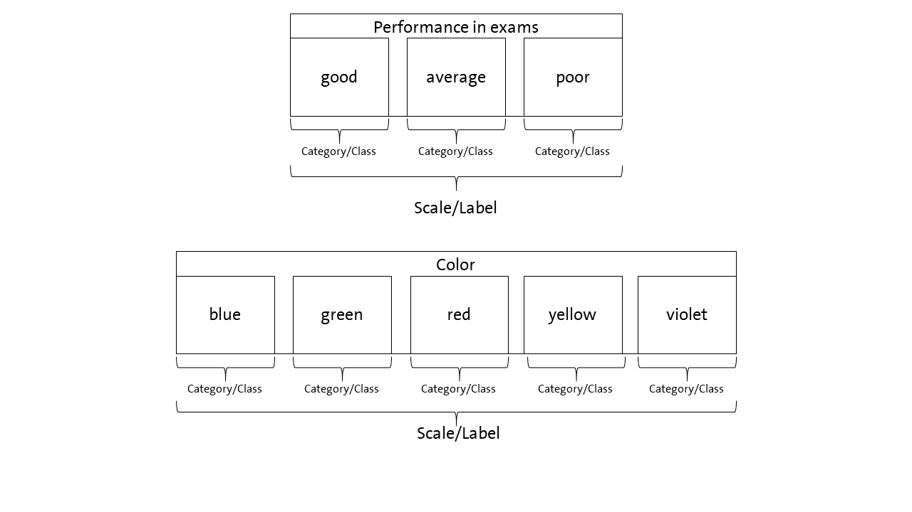
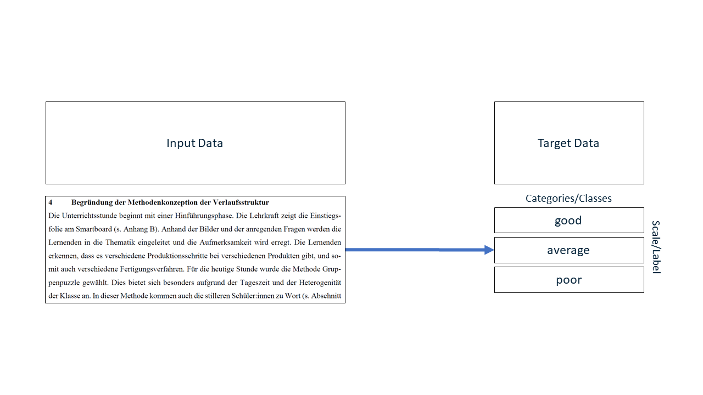
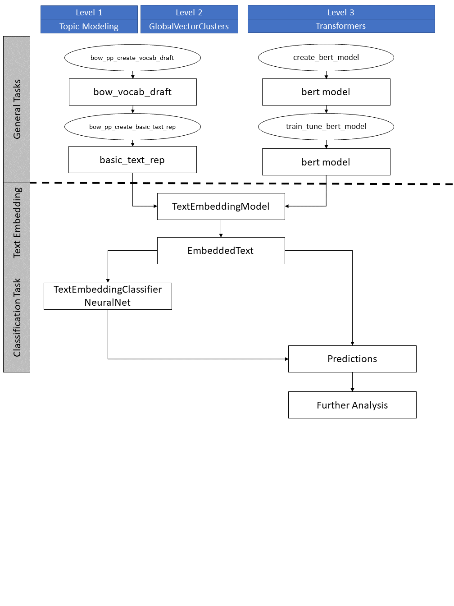

```{r, include = FALSE}
knitr::opts_chunk$set(
  collapse = TRUE,
  comment = "#>"
)
```

# 1 Introduction and Overview
In educational and social science assigning an observation to scientific concepts
is an important task allowing to understand an observation, to generate new
insights, and to derive recommendations for research and practice. 

In educational science several areas deal with this kind of task. For example, diagnosing
students characteristics is an important aspect of teachers' profession for understanding
and promoting learning. Another example is learning analytics where data about
students is used to provide learning environments adapted to their 
individual needs. On an other level institutions such as schools and universities
can use this information for a data driven decision about their performance
and where and how to improve it. In any case a real world
observations is aligned into scientific models in order to use scientific knowledge
as a technology for improving learning and instruction.

Supervised machine learning is one concept allowing to link real world observations
on the one hand and existing scientific models and theories on the other hand. For
educational sciences this is a great advantage because it allows to use the existing
knowledge and insights for applications of AI. The drawback of this approach is that
the training of AI requires both information about the real world observation on the one hand
and information on the corresponding alignment in scientific models and theories on the other hand.

A valuable source of data in educational science are texts since textual data
can be found everywhere in learning and teaching. For example, on the one side teacher often
demand students to solve a task which they provide in a written form. On the other side
students have to create a solution for the tasks which they often document with
a short written essay or a presentation. These data can be used for analyzing learning.
Teachers' written tasks for their students may provide insights into the quality
of instruction. Students' solutions may provide insights into their learning
outcomes and prerequisites. 

AI can be a helpful assistant in analyzing textual data since the analysis of 
textual data is a challenging and time consuming task for humans because they
have to conduct a content analysis. In this vignette we would like to show you how to create an AI that can help
you in such tasks by using the package *aifedcuation*. Before we start we have
to introduce a definition of our understanding of basic concepts since applying
AI to educational contexts means to link the knowledge of different scientific disciplines
using different sometimes, overlapping concepts. Figure 1 illustrates package's understanding.

{width=100%}
Since *aifeducation* looks at the application of AI for classification tasks
from the perspective of the empirical method of content analysis there is some 
overlapping between concepts of content analysis and machine learning. In content
analysis phenomenon like performance and colors can be described as a scale which
is made up by several categories. In our example an exam's performance 
could be "good", "average" or "poor". In terms of colors categories could be "blue",
"green" etc. Machine learning literature uses other words to describe this kind of data.
In machine learning "scale" corresponds to the term "label" and "categories" refer to 
the term "classes" (Chollet, Kalinowski & Allaire 2022, p. 114).

With these clarifications classification means that a text is assigned to the correct
category of a scale or that the text is labeled with the correct class. To train
an AI to classify a text accordingly two kind of data are necessary as Figure 2
illustrates. 

{width=100%}
By providing AI with both the textual data ans input data and the
corresponding information about the class as target data AI can learn
which texts imply a specific class or category. In the example of exams AI can learn
which texts imply a "good", "average" or "poor" judgment. After training
AI can be applied to new texts and predicts the most likely class of every new text.
The generated class can be used for further statistical analysis or
for deriving recommendations about learning and teaching.

To achieve this support by an artificial intelligence several steps are necessary.
Figure 3 provides an overview. 

{width=100%}

The first step is to transform raw texts into a form computers can use. That is,
the raw texts must be transformed into numbers. In *aifeducation* you can choose between 
several approaches:

 - *Topic Modeling:* Topic Modeling is an old approach that uses frequencies of tokens
 within a text. The frequencies of the tokens are models as the observable variables
 of one more latent topics. With topic modeling it is possible to create a model
 that describes the amount to which each token belongs to a specific topic. This
 information is used to create a text embedding by computing the relative amount 
 of every topic in a text on the basis of every token in a text.
 - *GlobalVectorClusters:* GlobalVectors is a newer approach which utilizes the
 co-occurrence of words/tokens to compute GlobalVectors. These vectors are generated in a way
 that tokens with a similar meaning are located near to each other. In order to
 create a text embedding, tokens are grouped into clusters based on their global
 vectors. Thus, tokens with a similar meaning are members of the same cluster. For
 the text embedding the tokens of a text are counted for every cluster and the
 frequencies of every cluster for that text are used as a numerical representation
 of that text.
 - *Transformers:* Tranformers are available in different ways. Currently only
 the BERT-architecture is implemented in *aifeducation*.

All the approaches are managed and used with a unified interface provided by the object
`TextEmbeddingModel`. With this object you can easily convert raw texts into
a numerical representation which you can use for different classification tasks
at the same time. This makes it possible to reduce computational time. The created
text embedding is stored in an object of class `EmbeddedText`. This object
additonally contains information about the text embedding model that created
this object. 

In the very best case you can apply an existing text embedding model by using 
a transformer from [Huggingface](https://huggingface.co/) or by using a model
from colleagues. If not *aifeducation* provides several functions allowing you 
to create your own models. Depending on the approach you would like to use 
different steps are necessary. In the case of Topic Modeling or GlobalVectorClusters 
you must first create a draft of a vocabulary with the two functions `bow_pp_create_vocab_draft` and
`bow_pp_create_basic_text_rep`. When calling these functions you determine central
properties of the resulting model. In the case of transformers you first have to
configure and to train a vocabulary with `create_bert_model` and in a next
step you can train your model with `train_tune_bert_model`. Every step will be
explained in the next chapters.

With an object of class `TextEmbeddingModel` you can create the input data for
the supervised machine learning. Additionally you need the target data which
must be a named factor containing the classes/categories of each text.

With both kind of data you are able to create a new object of class 
`TextEmbeddingClassifierNeuralNet` which is the classifier. For training of the
classifier you have several options which we will cover in detail in chapter 3.
After training the classifier you can share it with other researchers and apply
on new texts. Please note that the application to new texts requires that the
text is transformed into numbers with exactly the same text embedding model before 
passing the text to the classifier. That is, please do not pass the raw texts 
but only the embedded texts to the classifier.

In the next chapters we will guide you to the complete process. Starting with 
the creation of the text embedding models.

# 2 Preparation Tasks
## 2.1 Example Data for this Vignette
To illustrate the steps in this vignette we cannot use data from educational
settings since these data is in general protected by privacy policies. Therefore,
we use the data set `data_corpus_moviereviews` from the package quanteda.textmodels
to illustrate the usage of the package. This package is automatically installed
when you install *aifeducation*.
```{r, include = TRUE, eval=TRUE}
example_data<-data.frame(
  id=quanteda::docvars(quanteda.textmodels::data_corpus_moviereviews)$id1,
  label=quanteda::docvars(quanteda.textmodels::data_corpus_moviereviews)$sentiment)
example_data$text<-as.data.frame(quanteda.textmodels::data_corpus_moviereviews)

table(example_data$label)
```
We now have a data set with three columns. The first contains the id of the 
movie review, the second contains if the movie was rated positive or negative, and
the third column contains the raw text. As you can see the data is balanced.
About 1000 review imply a positive rating of a movie and about 1000 imply a negative
rating. We will now use this data to show you how to use the different objects
and functions in *aifeducation*.

## 2.2 Topic Modeling and GlobalVectorClusters
If you would like to create a new text embedding model with Topic Modeling or
GlobalVectorClusters you first have to create a draft of a vocabulary. You can
do this by calling the function `bow_pp_create_vocab_draft`. The main input 
of this function is a vector of texts. The function's aims are 

 - to create a list of all tokens of the texts, 
 - to reduce the tokens to tokens that carry semantic meaning,
 - to provide the lemma of every token.
 
Since TopicModeling depends on a bag-of-word approach the reason for this 
preprocess step is to reduce the tokens to tokens that really carry semantic
meaning. In general these are tokens of words that are either nouns, verbs or 
adjectives. With our example data an application of that function could be:

```{r, include = TRUE, eval=FALSE}
vocab_draft<-bow_pp_create_vocab_draft(
  path_language_model="language_model/english-gum-ud-2.5-191206.udpipe",
  data=example_data$text,
  upos=c("NOUN", "ADJ","VERB"),
  label_language_model="english-gum-ud-2.5-191206",
  language="english",
  trace=TRUE)
```

As you can see there is an additional parameter `path_language_model`. Here you
must insert the path to an udpipe pre-trained language model since this function
uses the *udpipe* package for part-of-speech tagging and lemmataziation. A collection of pre-trained
models for about 65 languages can be found here 
[https://lindat.mff.cuni.cz/repository/xmlui/handle/11234/1-3131]. Just download
the relevant model to your machine and provide the path to the model.

With the parameter `ups` you can select which tokens should be selected. In this
example only tokens that represent a noun, an adjective or a verb will remain after
the analysis. A list of possible tags can be found here: 
[https://universaldependencies.org/u/pos/index.html].

Please do not forget do provide a label for the udpipe model you use and
please also provide the language your are analyzing. This information is important
since this will be transferred to the text embedding model. Other researchers/users
will need this information in order to estimate if this model could help for their
own work.

In the next step we can use our draft of a vocabulary to create a basic
text representation with the function `bow_pp_create_basic_text_rep`.
This function takes raw texts and the draft of a vocabulary as main input. The
function aims 

 - to remove tokens referring to stopwords,
 - to clean the data (e.g., removing punctuation, numbers),
 - to lower case all tokens if requested,
 - to remove tokens with a specific minimal frequency,
 - to remove token that occur in to few or to many documents
 - to create a document-term-matrix,
 - to create a feature co-occurrence matrix.
 
Applied to the example the call of the function could look like this:
```{r, include = TRUE, eval=FALSE}
basic_text_rep<-bow_pp_create_basic_text_rep(
  data = example_data$text,
  vocab_draft = vocab_draft,
  remove_punct = TRUE,
  remove_symbols = TRUE,
  remove_numbers = TRUE,
  remove_url = TRUE,
  remove_separators = TRUE,
  split_hyphens = FALSE,
  split_tags = FALSE,
  language_stopwords="eng",
  use_lemmata = FALSE,
  to_lower=FALSE,
  min_termfreq = NULL,
  min_docfreq= NULL,
  max_docfreq=NULL,
  window = 5,
  weights = 1 / (1:5),
  trace=TRUE)
```

`data` takes the raw texts while `vocab_draft` takes the draft of a vocabulary
we created in the first step. 

The main goal is to create a document-term-matrix(dtm)
and a feature co-occurrence matrix (fcm). The dtm is a matrix that reports the
texts in the rows and the number of tokens in the columns. This matrix is later
used to create a text embedding model based on Topic Modeling. The dtm is
reduced to tokens that correspond to the part-of-speech tags of the vocabulary draft.
Punctuation, symbols, number etc. are removed from this matrix if
you set the corresponding parameter to `TRUE`. If you set `use_lemmata = TRUE` 
you can reduce the dimensionality of this matrix further by
using the lemmata instead of the tokens. If you set `to_lower = TRUE` all tokens
are transformed to lower case. At the end you get an matrix that tries to
represent the semantic meaning of the text with a minimum of tokens possible.

The same applies for the fcm. Here the tokens/features are reduced in the same way.
However, before the features are reduced the tokens co-occurrence is calculated.
For this a window is used and shifted across the text counting the tokens left
and right from a token under investigation. The size of this window can be determined
with `window`. With `weights` you can provide wights. For example that tokens
which are far away from the token under investigation count less as tokens that 
are near to the token under investigation. The fcm is later used for creating
a text embedding model based on GlobalVectorClusters.

As you may notices the dtm counts only the words in a text. Thus, their position in the
text or within a sentence does matter. If you further lower case tokens or use
lemmata more syntactic information is lost for the advantage that the dtm has
a lower dimensionality while losing only few semantic meaning. In contrast the 
fcm is a matrix that describes how often different tokens occur together.
Thus, fcm recovers part of the position of words in a sentence and in a text.

Now everything is ready to create a new text embedding model based in Topic
Modeling or GlobalVectorClusters. Before we show you how to create the new model
we will have a look on the preparation of a new transformer.

## 2.3 Creating a New Transformer
In general it is recommended to use a pre-trained model since the creation of a
new transformers requires a large data set of texts and is computational intensive.
In this vignette we will illustrated the process with a BERT model. However, for
many other transformers the process is the same.

The creation of a new transformer requires at least two steps. First you must
decide about the architecture of your transformer. This includes to create
a vocabulary. In *aifedcuation* you can do this by calling the function
`create_bert_model`. For our example this could look like this: 

```{r, include = TRUE, eval=FALSE}
basic_text_rep<-bow_pp_create_basic_text_rep(
create_bert_model(
    model_dir = "my_own_transformer",
    vocab_raw_texts=example_data$text,
    vocab_size=30522,
    vocab_do_lower_case=FALSE,
    max_position_embeddings=512,
    hidden_size=768,
    num_hidden_layer=12,
    num_attention_heads=12,
    intermediate_size=3072,
    hidden_act="gelu",
    hidden_dropout_prob=0.1,
    trace=TRUE)
```

First, you must provide a path to a directory where your new transformer should be
saved. Second, you must provide raw texts. These texts are **not** used for training
the transformer but for training the vocabulary. The maximum size of the vocabulary
is determined by `vocab_size`. Please do not provide a size about 50000 to 60000 since 
this kind of vocabulary works different to the approach from section 2.2. Modern
tokenizer such as *WordPiece* use algorithms that splits tokens into smaller elements
allowing them to build a huge number of words with a small number of elements. Thus,
even with only small number of about 30000 tokens they are able to represent a very large number
of words. As a consequence, these kind of vocabulary are many times smaller as the
vocabularies built in section 2.2.

the other parameters allow you to customize your bert model. For example, you could
increase the number of hidden layers from 12 to 24 or reduce the hidden size from 768
to 256 allowing you to built and to test larger or smaller transformers.

Please note that with `max_position_embeddings` you determine how many tokens
your transformer can process. If your text has more tokens *after* tokenazation these
tokens are ignored. However, if you would like to analyze long documents please
avoid to increase this number significantly because the computational times does not
increase linar but quadratic. For long documents you can use another architecture of BERT
(e.g. Longformer) of split a long document into several chunks. Using chunks is
supported with *aifedcuation*.

After calling the function you will find your new model in your model directory.
The next step is to train your model by calling `train_tune_bert_model`.

```{r, include = TRUE, eval=FALSE}
train_tune_bert_model(
  output_dir = "my_own_transformer_trained",
  bert_model_dir_path = "my_own_transformer",
  raw_texts = example_data$text,
  aug_vocab_by=0,
  p_mask=0.15,
  whole_word=TRUE,
  val_size=0.1,
  n_epoch=1,
  batch_size=12,
  chunk_size=250,
  n_workers=1,
  multi_process=FALSE,
  trace=TRUE)
```
Here, it is important that you provide the path to the directory where your new
transformer is stored. Furthermore, it is important that you provide *another*
directory where your trained transformer should be saved to avoid reading
and writing collisions. 

Now the provides raw data is used for training your model by using 
Masked Language Modeling. First, you can set the length of token sequences with `chunk_size`.
With `whole_word` you can chose between masking single
tokens or masking complete words (Please remember that modern tokenizers split
words into several tokens. Thus, tokens and word are not forced to match each other
directly). With `p_mask` you can determine how many tokens
should be masked. Finally, with `val_size` you set how many chunks should be used
for the validation sample. 

If you work on a machine and your graphic device has only a small memory please reduce
the batch size significantly. We also recommend to change the usage of memory with
`set_config_gpu_low_memory()`.

After the training finishes you can find our transformer ready to use in your 
output_directory. Now you are able to create a text embedding model.

# 3 Text Embedding 
## 3.1 Introduction
In *aifedcuation* a text embedding model is stored with an object of class 
`TextEmbeddingModel`. This object contains all relevant information for transforming
raw texts into a numeric representation that can be used for machine learning. 

In *aifedcuation* the transformation of raw texts into numbers is a separate step
from downstream task such as classification. The reason is to reduce computational time
on machines with low performance. By separating text embedding from other tasks
the text embedding has to be calculated only once and can be used for different
tasks at the same time. Another advantage 
is that the training of the downstream tasks involves only the downstream tasks an not
the parameters of the embedding model making training less time consuming and 
decreases the computational insensitivity. Finally, this approach allows the analysis of
long documents by applying the same algorithm on different parts of a long text.

The text embedding model provides a unified interface. That is, after creating
the model with different methods the handling of the model is the same.

In the following we will show you how to use this object. We start with Topic Modeling.

## 3.2 Creating Text Embedding Models
### 3.2.1 Topic Modeling
For creating a new text embedding model based on Topic Modeling you only need
a basic text representation generated with the function `bow_pp_create_basic_text_rep`
(see section 2.2). Now you can create a new instance of a text embedding model by
calling `TextEmbeddingModel$new()`.

```{r, include = TRUE, eval=FALSE}
topic_modeling<-TextEmbeddingModel$new(
  model_name="topic_model_embedding",
  model_label="Text Embedding via Topic Modeling",
  model_version="0.0.1",
  model_language="english",
  method="lda",
  bow_basic_text_rep=basic_text_rep,
  bow_n_dim=12,
  bow_max_iter=500,
  bow_cr_criterion=1e-8,
  trace=TRUE
)
```

First you have to provide a name for your new model (`model_name`). This should be 
a unique but short name without any spaces. With `model_label` you can provide
a label for your model with more freedom. It is important that you provide a version
for your model for the case that you will create an improved version in the future.
With `model_language` you provide users the information for which language your model
is designed. This is very important if you plan to share your model to a wider 
community.

With `method` you determine which approach should be used for your model. If you 
would like to use Topic Modeling you have to set `method = "lda"`. the number of
topics is set via `bow_n_dim`. In this example we would like to create a
topic model with 12 topics. The number of topics also determines the dimensionality
for our text embedding. That is, every text will be characterized by these 12 topics.

Please do not forget to pass your basic text representation to `bow_basic_text_rep`.

After the model is estimated it is stored as `topic_modeling` in our example.

### 3.2.2 GlobealVectorClusters
The creation of a text embedding model based on GlobalVectorClusters is very similar
to a model based on Topic Modeling. There are only two differences.

```{r, include = TRUE, eval=FALSE}
global_vector_clusters_modeling<-TextEmbeddingModel$new(
  model_name="global_vector_clusters_embedding",
  model_label="Text Embedding via Clusters of GlobalVectors",
  model_version="0.0.1",
  model_language="english",
  method="glove_cluster",
  bow_basic_text_rep=basic_text_rep,
  bow_n_dim=96,
  bow_n_cluster=384,
  bow_max_iter=500,
  bow_max_iter_cluster=500,
  bow_cr_criterion=1e-8,
  trace=TRUE
)
```

First, you request a model based on GlobalVectorCluster by setting `method="glove_cluster"`.
Second, you have to determine the dimensionalty of the global vectors with
`bow_n_dim` and the number of cluster by `bow_n_cluster`. When creating a new
text embedding model the global vectors of eacht token is calculated based on the
feature-co-occurrence matrix you provide with `basic_text_rep`. That is, for 
very token a vector is calculated with the length of `bow_n_dim`. Since these
vectors are **word** embeddings and not **text** embeddings an additional step is
necessary to create text embedding. In *aifedcuation* the word embeddings are used
to group the word into clusters. The number of cluster is set with `bow_n_cluster`.
Now, the text embedding results by counting the tokens of every cluster for every text.

The final model is stored as `global_vector_clusters_modeling`.

### 3.2.3 Transformers
Using a transformer for creating a text embedding model is simialr to the other 
both approaches.  

```{r, include = TRUE, eval=FALSE}
bert_modeling<-TextEmbeddingModel$new(
  model_name="bert_embedding",
  model_label="Text Embedding via BERT",
  model_version="0.0.1",
  model_language="english",
  method = "bert",
  max_length = 512,
  chunks=15,
  overlap=30,
  aggregation="last",
  use_cls_token=TRUE,
  bert_model_dir_path="my_own_transformer_trained"
  )
```

To request a model based on a transformer you must set `method` accordingly.
Since we use a BERT model in our example we have to set `method = "bert"`. Next,
you have to provide the directory where your model is stored. In this example
this would be `bert_model_dir_path="my_own_transformer_trained`.

Using a BERT model for text embedding is no problem since your text do not provide
more tokens as the transformer can process. This maximal value is set in the config
of the transformer (see section 2.3). If the text produces more tokens the last tokens
are ignored. In some cases you may want to analyze long texts. In these situations
reducing the text to the first tokens (e.g. only the first 512 tokens) could result in a problematic lose of
information. To deal with these situations you can config a text embedding model in 
*aifecuation* to split long texts into several chunks which are processed by the transformer.
The maximal number of chunks is set with `chunks`. In our example above, the 
text embedding model would split a text consisting of 1024 tokens into 2 chunks.
For every chunk a text embedding is calculated. As a results you receive a sequence
of embeddings. The first embeddings characterizes the first part of the text and
the second embedding characterizes the second part of the text. 
Thus, our example text embedding model is able to process texts with 15*512=7680 tokens.

Since transformers are able to account for the context it may be usefull to connect
every chunk in order to bring the context into the calculations. This can be done
with `overlap` determining how many tokens of the end of a prior chunk should be 
added to the next chunk. 

Finally, you have to decide if you would like the embedding of the classification
token [CLS] as text embedding or the mean of all token embeddings as text embedding
(`use_cls_token`). You can further decide from which hidden layer or layers
the embeddings should be drawn (`aggregation="last"`).

After deciding about the configuration you can use your model.

## 3.3 Transforming Raw Texts into Embedded Texts
Although the mechanics within a text embedding model are different the usage is 
always the same. To transform raw text into a numeric representation you only
have to use the embed method of your model. Therefore you must provide the
raw texts to `raw_text`. In addition, it is necessary that you provide
a character vector containing the id of every text. The ids must be unique.

```{r, include = TRUE, eval=FALSE}
topic_embeddings<-topic_modeling$embed(
  raw_text=example_data$text,
  doc_id=example_data$id, 
  trace = TRUE)

cluster_embeddings<-global_vector_clusters_modeling$embed(
  raw_text=example_data$text,
  doc_id=example_data$id, 
  trace = TRUE)

bert_embeddings<-bert_modeling$embed(
  raw_text=example_data$text,
  doc_id=example_data$id, 
  trace = TRUE)
```

The method `embed`creates an object of class `EmbeddedText`. This is just
a data.frame consisting the embedding of every text. Depending on the method
the data.frame has a different meaning:
 - *Topic Modeling:* In the case of Topic Modeling the rows represent the texts 
 and the columns represent the percentage of every topic within a text.
 - *GlobalVectorClusters:* In this case the rows represent the texts and the columns
 represent the absolute frequencies of tokens belonging to a semantic cluster.
 - *Transformer - Bert:* In the case of BERT the rows represent the texts and
 the columns represents the contextualizes text embedding that is Bert's understanding
 of the relevant text chunk.
 
Please not that in the case of Bert models the embeddings of every chunks are concatenated.

With the embedded texts you now have the input to train a new classifier or
to apply a pre-trained classifier for predicting categories/classes. In
the next chapter we will show you how to use these classifiers. But before
we start we will show you how to save and load your model.

## 3.4 Saving and Loading Text Embedding Models
Saving a created text embedding model is very easy. However, the saving
and loading process is different for model based on Topic Modeling and 
GlobalVectorClusters on the hand and models based on transformers on the other hand.

For models using Topic Modeling or GlobalVectorClusters you can call `save()` to
write your model to disk.
```{r, include = TRUE, eval=FALSE}
save(topic_modeling, 
     file="models/embedding_model_topic.RData")
save(global_vector_clusters_modeling, 
     file="models/embedding_model_gvc.RData")
```
If you want to load your model just call `load()` and you can continue using
your model.
```{r, include = TRUE, eval=FALSE}
load(file="models/embedding_model_topic.RData")
load(file="models/embedding_model_gvc.RData")
```

If your text embedding model is based on a transformer saving and loading 
requires some other steps. In this case your text embedding models serves as
an interface to *R*. The original model is saved in your model directory. Thus,
you have to save your interface to that model directory.
```{r, include = TRUE, eval=FALSE}
save(bert_modeling,
     file="my_own_transformer_trained/r_interface.RData")
```
Loading your model requires two steps. First, load the interface.
```{r, include = TRUE, eval=FALSE}
load(file="my_own_transformer_trained/r_interface.RData")
```
Now the text embedding model is available in *R.*. Next you must
re-initialize the transformer by calling the corresponding method `load_model` 
of your model.
```{r, include = TRUE, eval=FALSE}
bert_modeling$load_model(model_dir="my_own_transformer_trained")
```
Now you can use your text embedding model.

# 4 Using AI for Classification Tasks
## 4.1 Creating a New Classifier
In *aifedcuation* classifiers are based on neural nets and stored in objects
of class `TextEmbeddingClassifierNeuralNet`. You can create a new classifier
by calling `TextEmbeddingClassifierNeuralNet$new()`.

```{r, include = TRUE, eval=FALSE}
example_targets<-as.factor(example_data$label)
names(example_targets)=example_data$id

classifier<-TextEmbeddingClassifierNeuralNet$new(
  name="movie_review_classifier",
  label="Classifier for Estimating a Postive or Negative Rating of Movie Reviews",
  text_embeddings=bert_embeddings,
  targets=example_target,
  config=list(
    hidden=c(128,64),
    gru=c(128,128),
    dropout=0.2,
    recurrent_dropout=0.4,
    l2_regularizer=0.001,
    optimizer="adam",
    act_fct="gelu",
    act_fct_last="softmax",
    err_fct="categorical_crossentropy")
)
```

Similar to the text embedding model you should provide a name (`name`) and a
label (`label`) for your new classifier. With `text_embeddings`you have to provide
a embedded text. We would like to recommend that you use the embedding you would
like to use for training. We here continue our example and use the embedding
produced by our BERT model.

`targets` takes the target data for the supervised learning. Please do not
omit cases which have no category/class since they can be used with a special 
training technique we will show later. It is very important that you provide the
target data as factor. Otherwise an error will occur. It is also important
that you name your factor. That is, the entries of the factor mus have names
that correspond to the ids of the corresponding texts. Without these names
the method cannot match text embeddings as input data to the target data. 

`config` represents a list where you decide about the structure of your learner.
`hidden` takes a vector of integers determining the number of layers and the number
of neurons. In our example this are two layers. the first with 128 and the 
second with 64 neurons. `gru` also takes a vector of integers determining the number
and size of the Gated Recurrent Unit. In this example we use two layer with 128 each.

Since the classifiers in *aifeducation* use a standardized scheme for their 
creation, dense layers are used after the gru layers. If you want to omit gru layers
or dense layer set the argument to `NULL`. 

If you use a text embedding model that processes more than 1 chunk we would like
to recommend to use gru layers since they are able to use the sequential structure 
of your data. In all other cases you can rely on normal dense layers.

Masking, normalization, and the creation of the input layer as well as the output
layer is done automatically.

After you have created a new classifier you can begin training.

## 4.2 Training a Classifier
For starting the training of your classifier you have to call the `train` method.
Similar for the creation of the learner you must provide the text embedding to
`data_embeddings` and the categories/classes as target data to `data_targets`.
Please remember that `data_targets` expects a named factor where the names 
corresponds to the ids of the corresponding text embeddings. Text embeddings
and target data that cannot be matched are ommited from training. 

For training a classifier it is necessary that you provide a path to
`dir_checkpoint`. This directory stores the best set of weights during each
training step. After training these weights are automatically used as final weights
for the classifier. 

For performance estimation training splits the data into several chunky based on
cross fold validation. The number of folds is set with `data_n_valid_samples`. 
In every case one fold is not used for training and serves as test sample. The
reaming data is used to creating a training and a validation sample. All
performance values saved in the trained classifier refer to the test sample. That
is, this data has never been used during training and provides a more realistic
estimation of classifier`s performance.

```{r, include = TRUE, eval=FALSE}
example_targets<-as.factor(example_data$label)
names(example_targets)=example_data$id

classifier$train(
   data_embeddings = bert_embeddings,
   data_targets = example_targets,
   data_n_valid_samples=10,
   use_baseline=TRUE,
   bsl_val_size=0.25,
   use_bsc=TRUE,
   bsc_methods=c("dbsmote"),
   bsc_max_k=10,
   use_bpl=TRUE,
   bpl_max_steps=10,
   bpl_inc_ratio=0.25,
   bpl_anchor=0.75,
   bpl_valid_size=0.33,
   opt_model_reset=TRUE,
   epochs=100,
   batch_size=32,
   dir_checkpoint="tmp/checkpoints_classifier",
   trace=TRUE,
   view_metrics=FALSE,
   keras_trace=2,
   n_cores=2)
```

Since *aifedcuation* tries to address the special needs in educational and
social science some special training steps are integrated in this method. 

 - **Baseline:** If you are interested in training your classifier without applying
 any additional statistical techniques you should set `use_baseline = TRUE`. In this
 case the classifier is trained with the provided data as it is. Cases with missing values 
 in target data are omitted. Even if you would like 
 to apply further statistical adjustments it makes sense to compute a baseline model
 for comparing the effect of the modified training process with an unmodified
 training. By using `bsl_val_size` you can determine how many data should be
 used as training data and how many data should be used as validation data.
 - **Balanced Synthetic Cases:** In case of imbalanced data it is recommended to
 set `use_bsc=TRUE`. Now, before training a number of synthetic units is created
 via different techniques. Currently you can request *Basic Synthetic Minority Oversampling Technique*,
 *Density-Bases Synthetic Minority Oversampling Technique*, and
 *Adaptive Synthetic Sampling Approach for Imbalanced Learning*. The aim is to 
 create new cases that fill the gap to the majority class. Multiclass problems
 are reduced to a two class (class under investigation vs. each other) for generating these units.
 You can even request several techniques at once. If the number of synthetic units
 and original minority units exceed the number of cases of the majority class a
 random sample is drawn. If the technique allows to set the number of neighbors
 during generation of the cases the algorithm will call the technique several times
 for `k = 2` up to `k = bsc_max_k`.
 - **Balanced Pseudo Labeling:** This technique is relevant if you have a labeled
 target data and a large number of unlabeled target data. This option activates
 an implementation of pseudo labeling. That is, the classifier is trained with
 the cases for which labeled data is available. After training the classifier
 predicts the classes/categories for the unlabeled cases. A percentage of cases
 determined with `bpl_inc_ratio` is selected and added to the training and test
 sample according to `bpl_valid_size`. The classifier is trained with the
 extended data and after training its predicts the classes/categories of the remaining
 unlabeled data. This process is iterated as long as the pseudo-labeled data contains
 cases for every class/category. the process stops if the number of maximum steps is
 reached (`bpl_max_steps`) or all unlabeled data is used for training. Please note
 that the number of cases added within each step is determined for *all* classes/categories
 by the category with the lowest absolute frequency weighted with `bpl_inc_ratio`
 to ensure the balance of new cases. If more cases are available the cases are sorted
 by their distance to `bpl_anchor`. This is a value describing the certainty of the 
 pseudo labels. 0 equals random guessing, 1 equals perfect certainty. It is recommended
 to include cases which have a high but not a perfect certainty to improve the
 quality of the classifier.
 This technique requires `use_baseline = TRUE` or `use_bsc=TRUE`. If both is set to true a classifier
 trained on the basis of balanced synthetic cases is used.
 
Finally, `trace`, `view_metrics`, and `keras_trace` allow you to control how
many information about the training progress are printed to the console. Please
note that training the classifier can take some time. 

## 4.3 Evaluating Classifier's Performance
After finishing training you can evaluate the performance of the classifier. For
every fold the classifier is applied to the test sample and the results are
compared with the true categories/class. Since the test sample is never be part
of the training all performance measures provide a realistic idea of
classifier`s performance.

To support researchers in judging the quality of the predictions *aifeducation*
utilizes several measures and concepts from content analysis. These are 

- Iota Concept of the Second Generation
- Krippendorff's Alpha
- Percentage Agreement
- Gwet's AC1/AC2
- Kendall's coefficient of concordance W
- Cohen's Kappa with equal weights
- Fleiss' Kappa for multiple raters with exact estimation
- Light's Kappa for multiple raters

You can access the concrete values by accessing the field `reliability` which
stores all relevant information. In this list you will find the reliability values
for every fold and for every requested training configuration. In addition, the
reliability of every step within balanced pseud labeling is reported.

The central estimates for the reliabilites can be found via `reliability$val_metric_mean`.
In our example this would be:
```{r, include = TRUE, eval=FALSE}
classifier$reliability$val_metric_mean
```
You know have a table with all relevant values. Evaluating the performance of
a classifier is a complex task and behind the scope of this vignette. Here, we
would like to refer to the cited literature of content analysis and machine
learning.

## 4.4 Saving and Loading a Classifier
If you have created a classifier saving and loading is very easy due to the *R* package
*bundle*. you can just use `save()` and `load()`. In our example this could be

```{r, include = TRUE, eval=FALSE}
save(classifier,
     file="classifiers/movie_review.RData")

load(file="classifiers/movie_review.RData")
```

## 4.5 Predicting New Data
If you would like to apply your classifier to new data, two steps are necessary.
First, you must transform the raw text into a numerical expression by using
*exactly* the same text embedding model that was used for training your classifier.
The resulting object can be passed to the method `predict` and you will get
the predictions together with an estimate of certainty for each class/category. 

# References
