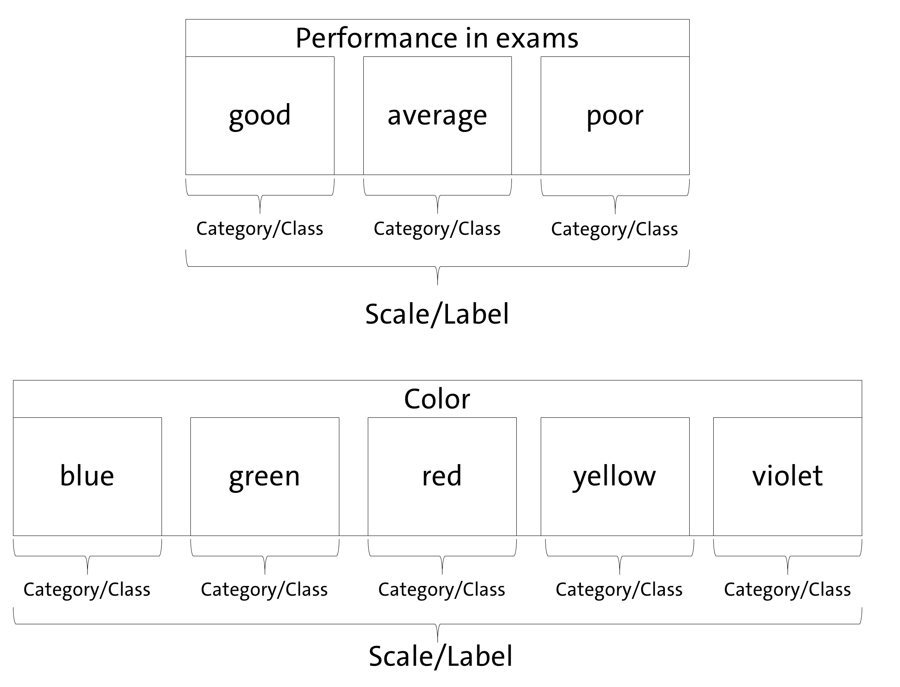
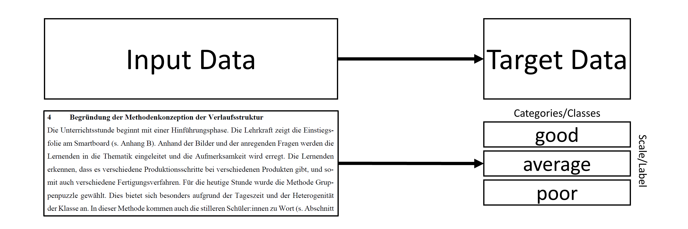
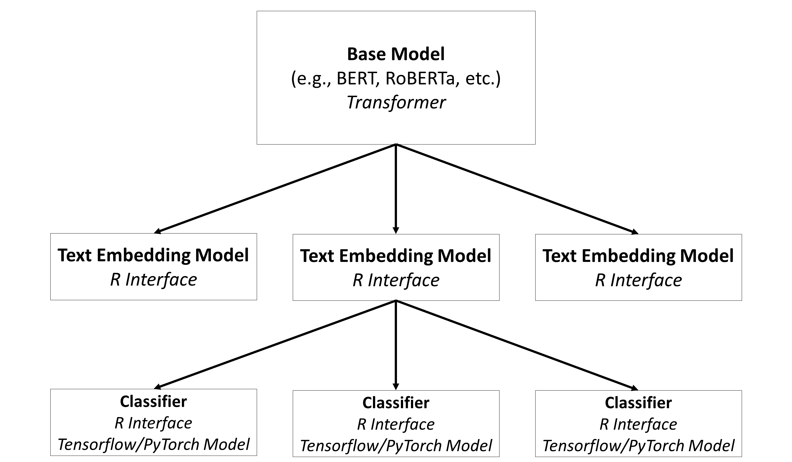

```{r, include = FALSE}
knitr::opts_chunk$set(
  collapse = TRUE,
  comment = "#>"
)
library(aifeducation)
```

# 1 Introduction and Overview
## 1.1 Preface

This vignette aims to introduce *aifeducation - Studio* which is a graphical
user interface for creating, training, documenting, analyzing, and applying 
artificial intelligence (AI). It is made for users which are unfamiliar with *R* 
or do not have any coding skills in relevant languages (e.g., python). 
For more experienced users the interface provides
a convenient way for working with AI in an educational context. 

This article overlaps with the vignette [02b classification tasks](classification_tasks.html)
which explains how to use the package with *R* syntax. We assume that 
*aifeducation* is installed as described in the vignette [01 get started](https://fberding.github.io/aifeducation/articles/aifeducation.html). The
introduction starts with a brief explanation of basic concepts which are necessary
for working with this package.

## 1.2 Basic Concepts
In the educational and social sciences, the assignment of an observation
to scientific concepts is an important task that allows researchers to
understand an observation, to generate new insights, and to derive
recommendations for research and practice.

In educational science, several areas deal with this kind of task. For
example, diagnosing students' characteristics is an important aspect of a
teachers' profession and necessary to understand and promote learning.
Another example is the use of learning analytics, where data about
students is used to provide learning environments adapted to their
individual needs. On another level, educational institutions such as
schools and universities can use this information for data-driven
performance decisions (Laurusson & White 2014) as well as where and how
to improve it. In any case, a real-world observation is aligned to
scientific models to use scientific knowledge as a technology for
improved learning and instruction.

Supervised machine learning is one concept that allows a link between
real-world observations and existing scientific models and theories
(Berding et al. 2022). For educational sciences this is a great
advantage because it allows researchers to use the existing knowledge
and insights for applications of AI. The drawback of this
approach is that the training of AI requires both information about the
real world observations and information on the corresponding alignment
with scientific models and theories.

A valuable source of data in educational science are written texts,
since textual data can be found almost everywhere in the realm of
learning and teaching (Berding et al. 2022). For example, teachers often
require students to solve a task which they provide in a written form.
Students have to create a solution for the tasks which they often
document with a short-written essay or a presentation. This data can be
used to analyze learning and teaching. Teachers' written tasks for their
students may provide insights into the quality of instruction while
students' solutions may provide insights into their learning outcomes
and prerequisites.

AI can be a helpful assistant in analyzing textual data since the
analysis of textual data is a challenging and time-consuming task for
humans.

> Please note that an introduction to content analysis, natural language
processing or machine learning is beyond the scope of this vignette. If
you would like to learn more, please refer to the cited literature.

Before we start it is necessary to introduce a definition of our
understanding of some basic concepts since applying AI to educational
contexts means to combine the knowledge of different scientific
disciplines using different, sometimes overlapping concepts. Even within
a research area, concepts are not unified. Figure 1 illustrates this
package's understanding.

{width="100%"}

Since *aifeducation* looks at the application of AI for classification
tasks from the perspective of the empirical method of content analysis,
there is some overlapping between the concepts of content analysis and
machine learning. In content analysis, a phenomenon like performance and
colors can be described as a scale/dimension which is made up by several
categories (e.g. Schreier 2012 pp. 59). In our example, an exam's
performance (scale/dimension) could be "good", "average" or "poor". In
terms of colors (scale/dimension) categories could be "blue", "green",
etc. Machine learning literature uses other words to describe this kind
of data. In machine learning, "scale" and "dimension" correspond to the
term "label" while "categories" refer to the term "classes" (Chollet,
Kalinowski & Allaire 2022, p. 114).

With these clarifications, classification means that a text is assigned
to the correct category of a scale or that the text is labeled with the
correct class. As Figure 2 illustrates, two kinds of data are necessary
to train an AI to classify text in line with supervised machine learning
principles.

{width="100%"}

By providing AI with both the textual data as input data and the
corresponding information about the class as target data, AI can learn
which texts imply a specific class or category. In the above exam
example, AI can learn which texts imply a "good", an "average" or a
"poor" judgment. After training, AI can be applied to new texts and
predict the most likely class of every new text. The generated class can
be used for further statistical analysis or to derive recommendations
about learning and teaching.

In use cases as described in this vignette AI has to understand natural language. 
„Natural language processing is an area of research in computer science and artificial intelligence (AI) concerned with processing natural languages such as English and Mandarin. This processing generally involves translating natural language into data (numbers) that a computer can use to lean about the world. (…)” (Lane , Howard & Hapke 2019, p. 4)

Thus, the first step is to transform raw texts into a form computers can use.
That is, the raw texts must be transformed into numbers. In modern
approaches, this is usually done through word embeddings. Campesato
(2021, p. 102) describes them as "the collective name for a set of
language modeling and feature learning techniques (...) where words or
phrases from the vocabulary are mapped to vectors of real numbers." The
definition of a word vector is similar: „Word vectors represent the
semantic meaning of words as vectors in the context of the training
corpus." (Lane, Howard & Hapke 2019, p. 191) In a next step the words or text 
embeddings can be used as input data and the labels
as target data for training AI to classify a text.

In *aifeducation* these steps are covered with three different type of models as
shown in Figure 3.

{width="100%"}

- **Base Models:** The base models are the models which contain the capacities to understand
natural language. In general, these are transformers such as BERT, RoBERTa etc. A huge number
of pre-trained models can be found on [Huggingface](https://huggingface.co/). 

- **Text Embedding Models:** The modes are built on top of base models and store
how to use the base models for converting raw texts into sequences of numbers. Please note
that the same base model can be used to create different text embedding models.

- **Classifiers:** Classifiers are used on top of a text embedding model. They are used
to classify a text into categories/classes based on the numeric representation provided
be the corresponding text embedding model. Please note a text embedding model can be 
used to create different classifiers (e.g. one classifier for colors, one classifier
to estimate the quality of a text etc.).

With this the help of this overview we can start the introduction of 
*Aifeducation Studio*.

# 2 Starting Aifeducation Studio
We recommend to start with a clean *R* session. Than you can start aifeducation studio
by entering the following into the console:
```{r, include = TRUE,eval=FALSE}
aifeducation::start_aifeducation_studio()
```
Please not that this can take a moment. 

At the beginning you will see the start page (Figure 4). Here you can configure your
current session. First, it is very important that you choose the machine learning
framework that you would like to use during the session (point 1). This choice cannot
be changed after the session starts. To change the framework you have to restart 
*Aifeducation Studio* again. 

{width="100%"}

Depending on the chosen framework you can make some further
settings (point 2). If you would like to use tensorflow and your computer has a 
graphic device with low memory we recommend to activate the option for low memory. 
For pytorch not further settings are necessary.

On the right side of the start page you
can decide if energy consumption should be recorded during training AI. Tracking
energy consumption allows to estimate the CO2 emissions of using AI. Since our
world faces the challenge of climate change we recommend to enable this option.
In this case you have to choose your country in order to allow a more accurate
estimation of the model's sustainability impact.

If you are ready you can press the start button (point 3) which directs you to
the home page.

# 3 Using Aifeducation Studio
## 3.1 Preparing Data
### 3.1.1 Collections of Raw Texts
The fist step in working with AI is to gather and to structure data. In the 
scope of *aifeducation* data can be either a collection of raw texts, sequences
of numbers representing the texts (text embeddings) or texts' labels. 

Collections of raw texts are necessary in two cases: First, to train or to
fine tune base models. Second to transform texts into texts embeddings which
can be used as input for training a classifier or for predicting the texts' labels
via classifier.

To create a collection of raw text you have to choose the data preparation page
on the right side as shown in Figure 5.
{width="100%"}
 On the resulting page you first have to choose the directory where the texts are
 stored (point 1). We recommend that you store all texts you would like to use
 in a single folder. Within this folder you can structure your data with
 sub-folders. In the case you use sub-folder please ensure that you include them
 for creating a collection of raw texts (point 2).
 
 In the next step you can decide which file formats should be included (point 3). Currently,
 *aifeducation* supports .pdf, .csv, and .xlsx files. If turned on all files 
 of the requested file format are included in your data collection.
 
 In the case you would like to consider .xlsx files **all** files must have
 one column containing the texts and one column for the texts' ids as shown in Figure 6.
 The name for the corresponding columns must be identical for all files and you have
 to provide the name (point 4).
 
{width="50%"} 

The last step is to choose a folder where your collection of raw texts should be
saved. Please select a folder and provide a name for your file (point 5).

Finally you can start creating the collection (point 6). Please note that his can take some
time.

When the process finishes you have a single file which can be used for further tasks.
The file contains a data.table that stores the ids of the texts together with their ids.
In the case of .xlsx files the texts' ids are set to the ids stored in the corresponding column
for id. In the case of .pdf and .csv files the file names are used as id (without
the file extension). 

{width="50%"} 

>Please note that a consequence of this is that two files *text_01.csv* and *text_01.pdf* have
the same id which is not allowed. Please ensure that you use unique ids across file formats.

The ids are very important since they are used to match the corresponding label
if available.

### 3.1.2 Collections of Texts' Labels

Labels are necessary if you would like to train a classifier. The easiest way
is to create a table that contains a column for the texts' id and one or several
columns that contain the texts' categories/classes. Supported file formats are 
.xlsx, .csv, and .rda/rdata. Figure 8 illustrates an example for 
a .xslx file.

{width="50%"} 

> In any case the table must contain a column with the name "id" which contains the texts' ids. 
All other columns must also have unquie names.

## 3.2 Base Models
### 3.2.1 Overview
Base models are the foundation of all further models in *aifeducation*. At the moment
these are transformer models such as BERT (Devlin et al. 2019), RoBERTa (Liu et al.
2019), DeBERTa version 2 (He et al. 2020), Funnel-Transformer (Dai et
al. 2020), and Longformer (Beltagy, Peters & Cohan 2020). In general,these models
are trained in a first step on a large corpus of general texts. In a next step the models
are fine-tuned to domain-specific texts and/or fine-tuned for specific tasks. Since
the creation of base models requires a huge number of texts resulting in high
computation time it is recommended to use already pre-trained models. These can
be found on [Huggingface](https://huggingface.co/). Sometimes however, it is more
straightforward to create a new model directly for a specific purpose. Aifeducation
Studio supports both the creation and the training/fine-tuning of base models.

### 3.2.2 Creation of Base Models
In order to create a new base model you have to choose the option "Create" on the 
tab "Masked Language Modeling" on the right side of the app (Figure 9).

{width="100%"}
Every transformer model is composed of two parts. On the one hand the tokenizer which splits raw texts into smaller pieces in order to model a large number of words with a limited
and small number of tokens. On the other hand the neural network that is used 
for modeling the capabilities for understanding natural language.

At the beginning you can choose between the different supported transformer architectures
(point 1). Depending on the architecture you have different options
determining the shape of your neural network (point 2). 

In the middle you find a box "Vocabulary". Here you must provide the path to
a file which contains a collection of raw texts. These raw texts are used to calculate
the vocabulary of the transformer (point 3). This file should be created with
*Aifeducation Studio* to ensure compatibility. See section 3.1.1 for more details.
It is very important that you provide a number of how many tokens the vocabulary
should include (point 4). Depending on the transformer method you can set additional
options affecting transformer's vocabulary (point 5).

- **Transform to lower:** If this option is enabled all words in a raw text are
transformed to lower cases. Thus, the resulting token of *Learners* and *learners*
are the same. If disabled *Learners* and *learners* will have a different tokenization.

- **Add Prefix Spaces:** If enabled a space is added to the first word if there
is not already one. Thus enabling this options leads to a similar tokenization
for the word *learners* in both cases: 1) "learners need a high motivation for high
achievement." and 2) "A high motivation is necessary for learners to achieve high
performance.".

- **Trim Offsets:** If this option is enabled the whitespaces of the produced offsets 
are trimmed.

The last step is to choose a folder where the new base model should be saved 
(point 6). Finally you can start the creation of your model by clicking on 
the button "Start Creation". The creation of the model may take some time.

### 3.2.3 Train/Tune a Base Model
In order to train a new base model (see section 3.2.2) the first time or for 
adapting a pre-trained model to a domain-specific language or tasks you have
to click on "Train/Tune" on the right side of the app. You can finde this option
via "Language Modeling" as shwon in Figure 10.

{width="100%"}

In the first step you have to choose the base model you would like to train/tune.
Please note that every base model consists of several files. Thus you cannot
provide one or multiple files. Instead you have to provide the folder that stores
the entire model. 

Compatible models are all base models that you have created with *Aifeducation Studio*.
In addition you can use any model from [Huggingface](https://huggingface.co/) that
uses an architecture implemented in *aifeducation* such as BERT, DeBERTa etc.

After choosing a base model new boxes appear as shown in Figure 11. To train a model you must first provide a collection of raw texts (point 1). We recommend that you
create this collection of texts as described in section 3.1.1.

{width="100%"}

Next you can configure the training of you base model (point 2):

- **Chunk Size:** For training and validating a base model the raw texts are split
into several smaller texts. This value determines the maximum length of these smaller
text pieces in number of tokens. This value cannot exceed the maximum size set during
creation of the base model. 

- **Minimal Sequence Length:** This value determines the minimal length of a text chunk
in order to be part of the training and validation data.

- **Full Sequences Only**: If this option is enabled only text chunks with a number
of tokens equal to "chunk Size" are included in the data. Disable this option if
you have a lot of small text chunks you would like to use for training and validation.

- **Probability of Token Masking:** This option determines how many tokens of every
sequence should be masked.

- **Whole Word Masking:** If this option is activated all tokens belonging to a
single word are masked. If this options is disabled or not available token masking
is used.

- **Validation Size:** This option determines how many sequences should be used for
validating the performance of the base model. Sequences used for validation are not
available for training.

- **Batch Size:** This option determines how many sequences should be processed at
the same time. Please adjust this value to the computation capacities of your machine.

- **n Epochs:** The maximum number of epochs for training. During training the model
that has the best validation loss is saved on disk an will be used for the final model.

- **Learning Rate:** The initial learning rate.

In the last step you have to provide the directory where your trained model should
be saved after training (point 3). the corresponding folder will also contain
the checkpoints during training. It is very important that this directory is not
the same directory where you stored the original model.By clicking in the button
"Start Training/Tuning" the training of you model starts. Please note that the 
training of a base model can last days or even weeks depending on the size of your
model, the kind of model, the amount of data, and the capacities of your machine. 

## 3.3 Text Embedding Models
### 3.3.1 Create a Text Embedding Model
The text embedding model is the interface to *R* in *aifeducation*. In order to
create a new model you need a base model that provides the ability to understand 
natural language. You can open the creation page by clicking on "Interface" via
"Language Modeling" (see Figure 12).

{width="100%"}

First you have to choose the base model that should form the foundation of your
new text embedding model. Please do select the folder that contains the entire model
and not single files. 

After choosing a model new boxes appear which allow you to customize your interface (point 1 in Figure 13).
Here it is very important that you give your model a unique name and label. The 
difference between *Name* and *Label* is that *Name* is used for the computer and *Label* for 
users. Thus, *Name* should not contain any spaces or special characters. *Label* does
not have any restrictions. Think of *Label* as a title of a book or paper. 
With *Version* you can provide a version number if you create a newer version of
your model. In the case you create a new model we recommend to use "0.1". For
*Language* it is necessary that you that which language your model is created for
such as English, French, German etc.

{width="100%"}

On the right side of the box (point 2) you can set how the interface should process
raw texts:

- **N chunks:** Sometimes texts are very long. With this value you can decide in how 
many chunks long texts should be divided. The maximum length of very chunk is determined 
by the value provided with "Maximum Sequence Length".

- **Maximal Sequence Length:** This values determines the maximum number of tokens
your model processes for every chunk. 

- **N Token Overlap:** This value determines how many tokens form the prior chunk
should be included in the current chunk. An overlap can be useful to provide the correct
context for every chunk.

- **Aggregation Hidden States**: Base models transform raw data into a sequence of
number. With this option you can decide how these numbers are generated. In general,
the hidden states of the last layer are used as a numeric representation. 

The maximum number of tokens your model can process and provide for downstream
tasks can be calculated as 
$$
Max Tokens = NChunks*MaximalSequenceLength-(NChunks-1)*NOverlap
$$
If the text is longer the remaining tokens are ignored and lost for further
analysis.

>Please note that you can create multiple text embeddings model with a
different configuration based on the same base model.

The last step is to provide a folder where to save the model and to provide
a name for the model's folder (point 3).

### 3.3.2 Using a Text Embedding Model
Using a text embedding model is a central aspect of applying artificial intelligence
in *aifeducation*. The corresponding page can be found by clicking on "Use" in the
tab "Language Modeling". At the start you have to choose the model that you
would like to use. Please select the folder that contains the entire model instead
of selecting single files. After selecting and loading a model a new box appears that shows you the different aspects of the model and how you can use it. 

The tab *Model Description* provides you with the documentation of the model.

The tab *Create Text Embeddings* allows you to transform raw texts into a numerical
representation of these texts called text embeddings. These text embeddings can 
be used in downstream tasks such as classifying texts. In order to transform 
raw texts into embedded texts you first have to select a collection of raw texts 
(point 1 in Figure). We recommend that you create this collection according to
section 3.1.1. Next you have to provide a folder where to store the embeddings and
a file name (point 2). With *Batch Size* you can determine how many raw texts should
be processed simultaneously. Please adjust this value to your machine's capacities.
By clicking on the button "Start Embed" the transformation of texts begins.

The tab *Encode/Decode/Tokenize* offers you insights in how your text embedding
model processes data. In the box *Encode* you can insert a raw text and after clicking on
*Encode* you can see how the text is divided into tokens and their corresponding
ids. The ids are passed to the base model and are used for generating the numeric
representation of a text. The box *Decode* allows you to revers this process. That is,
here you can insert a sequence of numbers (separated with a comma or with spaces)
and after clicking on *Decode* the corresponding tokens and the raw text appears.

Finally, the tab *Fill Mask* allows you to request the underlying base model of
your text embedding model to calculate a solution to a fill-in-the-blank text.
In the box *Text* you can insert a raw text. A gap is signaled by insert the 
corresponding masking token. This token can be found in the table above in the
row for "mask_token". If you insert a gap/mask_token please ensure the correct spelling.
With *N Solutions per Mask" you can determine how many tokens the model should
calculate for every gap/mask_token. After clicking in *Calculate Tokens* you will
find a graphic on the right side of the box showing you the most reasonable token
for the selected gap together. The tokens are ordered by certainty. That is, from
the perspective of the model the most reasonable tokens are at the top and the
less reasonable tokens are at the bottom.

### 3.3.3 Documenting a Text Embedding Model
Creating "good" AI models requires a lot of effort. Thus, sharing work with
other persons is very important for supporting progress in a discipline or field.
This makes a meaningful documentation necessary. In addition, a well written documentation
makes an AI model more transparent allowing to understand how the a model 
generated a solution. This is also very important in order to judge the limitation
of a model.

To support developers in documenting their work *Aifeducation Studio* provides an 
easy way to add comprehensive description of your work. You find this part of the
app by clicking on "Document" in the tab "Language Modeling". Fist you have to choose
the text embedding model you would like to document (not the base model).

After choosing a model a new box appears allowing you to insert all necessary information.
Via the tabs *Developers* and *Modifiers* you can provide the names and mail addressees
of all relevant persons. *Developers* refer to the persons who created a model while
*Modifiers* refers to the persons who adapted a pre-trained model to another
domain or task.

Within the tabs *Abstract* and *Description* you can provide an abstract and a detailed description of your work in English and/or in the native language of your
text embedding model (e.g., French, German etc) allowing you to reach a broad
audience. In all four tabs you can provide you documentation in plain text, html,
and/or markdown allowing you to insert tables or to highlight parts of your documentation.
If you would like to see how your documentation will look in the internet you
can click on the button *Preview*. Saving your changes is possible by clicking on
*Save*.

> For more information on how to document your model please refer to the 
vignette [03 sharing and using trained AI/models](sharing_and_publishing.html).

## 3.4 Classifiers
### 3.4.1 Create a Classifier
Classifiers are built on top of a text embedding model. To create a classifier
click on "Create and Train" in the tab "Classification". 

Creating a classifier
requires two different kinds of data. First, a text embeddings of a collection
of texts. These embeddings should be created with a text embedding model as 
described in section 3.3.2. Second a table with the labels of every text. This
kind of data should be created as described in section 3.1.2.

You can provide the text embeddings by opening the corresponding file in the
first box (point 1). After selecting the embeddings you will see a summary
of the underlying text embedding model that generated the embeddings. In addition 
you can see how many documents are in the file. 

>Please note that the classifier is bound to the text embedding model that generated
the embeddings. That is, the classifier can only be used if you have access to
the correspoing text embedding model. The text embedding model is necessary for
transforming the raw texts in a format that the classifier can understand.

Within the second box you can select the file that contains the corresponding labels (point 2).
After loading the file you can select the column of the table that you would like
to use as target data for training. In addition you can see a short summary of
the absolute frequencies of the single classes/categories. 

>Please not that you can create mutiple classifiers for different target data based
on the same text embedding model. Thus, there is no need to create a new text
embedding model for a new classifier. In particular, you can use the same text
embeddings for training different classifiers.

In the third box you create the architecture of your neural network. It is very
important that you provide the model's name and label in the section *General*.
The *Model Name* is used for internal purposes by the machine while the *Model Label*
is used as a title of your classifiers for users. Thus, the *Model Name* should not
contain any spaces or special characters. For *Model Label* there are no restrictions.

To expand the different sections you can click on the "+" on the right side. 
A detailed explanation of every single option is behind the scope of this
introduction. Here we can only provide an overview.

- **Positional Embedding:** By activating this option you add positional embedding
to your classifier. This provides the neural network with the ability to take
the order within a sequence into account.
- **Encoding Layers:** These layers are similar to encoding layers used in some transformer
models allowing to calculate context sensitive text embeddings. That is, they
provide your classifier with the ability to take the surrounding text chunks (see section 3.3.1) of the sequences into account. 
- **Recurrent Layers:** This section allows you to add recurrent layers to your classifier.
These layers are able to take the order within a sequence into account. In order to 
add these layers just pass number to the input field *Reccurent Layers* and separate them
with a comma or space. Every number represents a layer and the number determines
the number of neurons. Below the field you can see a what *Aifeducation Studio* understand
of your input. This is helpful to avoid invalid specifications of layers.
- **Dense Layers:** In this section you can add dense layers to your network. The 
process to add layers is similar to the process of recurrent layers.
- **Optimizer:** Here you can choose between different optimizer for training.

The next box contains the setting for training your classifier. Going into details
is again beyond the scope of this introduction. Here we can only provide an overview.

**Section: General Setting**

- **Balance Class Weights**: If this option is enabled the loss is adjusted to
the absolute frequencies of the classes/categories according to 
'Inverse Class Frequency' method. This option should be activated if you have to deal
with imbalanced data.
- **Number of Folds:** The number of folds used for estimating the performance of
your classifier.
- **Proportion for Validation Sample:** The percentage of cases within each fold used
as a validation sample. This sample is used to determine the state of the model that
generalizes best.
- **Epochs:** Maximal number of epochs. During training the model with the best
balanced accuracy is saved and used.
- **Batch Size:** The number of cases that should be processed simultaneously.
Please adjust this value to your machine's capacities. Please note that the batch
size can have an impact on the classifier's performance.

**Section: Baseline Model**

- **Calculate Baseline Model:** If active the performance of a baseline model is
estimated. That is, a model without applying *Balanced Pseudo Labeling* and without
*Balanced Synthetic Cases*.

**Section: Balanced Synthetic Cases**

- **Add Synthetic Cases:** If active the creation of additional synthetic cases is 
applied during training. That is synthetic cases are added to the data. The way these
cases are generated can be configured with the following parameters.
- **Number of Cores:** The number of cores which can be used for generating the
synthetic cases. A higher number can seed up the training process.
- **Method:** The method which should be used for generating the cases.
- **Max k:** The maximum number of neighbors used for generating the synthetic cases.
The algorithm will create cases up to this k and draws a random sample from it.
- **Proportion for Validation Sample:** The percentage of synthetic cases which 
should be added to the validation sample instead to the training sample.
- **Add All Synthetic Cases:** If enabled all synthetic cases are added. If disabled
only the number of cases is added to the sample to ensure a balanced frequency of
all classes/categories. 

**Section: Balanced Pseudo Labeling**

- **Add Pseudo Labeling:** If activated pseudo labeling is used during training.
The way pseudo labeling is applied can be configured with the following parameters.

- **Max Steps:** The number of steps during pseudo labeling. In the first step
1/Max Steps pseudo labeled cases are added, in the second step 2/Max Steps pseudo labeled cases are added etc. Which cases are added can be influenced by *Balance Pseudo Labels*, *Certainty Anchor*, *Max Certainty Value*, and *Min Certainty Value*.

- **Balance Pseudo Labels:** If this option is active the same number of pseudo 
labeled cases is added for every class/category. In general this number is determined
by the class with the smallest absolute frequency.
- **Certainty Anchor:** Value determine the reference point for choosing pseudo labeled
cases. 1 refers to perfect certainty, 0 refers to a certainty similar to random guessing. Selected are the cases that are closest to this value.
- **Max Certainty Value:** Pseudo labeled cases exceeding this value are not included
during training.
- **Min Certainty Value:** Pseudo labeled cases falling bellow this value are not included during training.

- **Reset Model After Every Step:** If enabled the classier is set to an untrained
state. This can prevent overfitting.
- **Dynamic Weight Increase**: If enabled the sample weights of the pseudo labeled
cases increases with every step. The weights are determined with *Start Weights* and
*Weight Increase per Step*.
- **Start Weights:** Initial value for the sample weights of the included pseudo labeled cases.
- **Weight Increase per Step:** Value determining how much the sample weights are
increased for the included pseudo labeled cases in every step. 

We recommend to use pseudo labeling as described by Cascante-Bonilla et al. (2020), 
Therefore the following parameters have to be set:

-   `bpl_max_steps = 5` (splits the unlabeled data into five chunks)
-   `bpl_dynamic_inc = TRUE` (ensures that the number of used chunks
    increases at every step)
-   `bpl_model_reset = TRUE` (re-initializes the model for every step)
-   `bpl_epochs_per_step=30` (number of training epochs within each
    step)
-   `bpl_balance=FALSE` (ensures that the cases with the highest
    certainty are added to training regardless of the absolute
    frequencies of the classes)
-   `bpl_weight_inc=0.00` and `bpl_weight_start=1.00` (ensures that
    labeled and unlabeled data have the same weight during training)
-   `bpl_max=1.00`, `bpl_anchor=1.00`, and `bpl_min=0.00` (ensures that
    all unlabeled data is considered for training and that cases with
    the highest certainty are used for training.)
    
Within the last box you have to provide a directory where to save the model. The
name of the folder created within that directory can be set with *Folder Name*.

Before you start training you can check how many cases can be matched between
the text embeddings and the target data by clicking on the button *Test Data Matching*.
This allows you to check if the structure of the data is working. If everything is 
okay you can start training the model by clicking on *Start Training*. Please note
that training a classifier can take up to several hours.

### 3.4.2 Using a Classifier
In the case you have trained a classifier or a classifier trained from other
persons you can analyze the model's performance or use the model for classify 
new texts. Therefore you have to select "Use" in the tab "Classification".

Similar to the other functions of this app you first have to select the classifier
by providing the folder that contains the entire model. Please note that a classifier
is made up by several files. Thus *Aifeducation Studio* asks you to select the folder
containing these files and not to select single files.After loading a classifier a 
new box appears. 

On the first tab *Model Description* you will find the documentation of the model.

On the second tab *Training* you receive a summary of the training process of the model.
This includes a visualization of the loss, the accuracy, and the balanced accuracy
for every fold and every epoch. Depending on the applied training techniques (such
as *Balanced Pseudo Labeling*) you can request additional graphics.

The third tab *Reliability* provides you with information on the quality of the
model. Here you find visualizations giving you insights in how the classifier
is able to generate reliably results. In addition measures from content analysis
as well from machine learning allow you to analyze specific aspects of the model's
performance.

The last tab *Prediction* allows you to apply a trained model to new data. That is,
here you can use the trained model to assign classes/categories to new texts. For
this purpose you must first provide the file that contains the text embeddings of the
documents you would like to classify. You can create these embeddings with the
text embedding model used for providing the training data of the classifier. The necessary
steps are described in section 3.3.2.

>These embeddings must be created with the same text embedding model that
created the text embeddings for training. If not an error will occur. 
See section 3.4.1 and 3.3.2 for more details.

The next step is to provide a folder where to save the predictions and to provide a
file name. The default case is to store the predictions in a file of format .rda 
allowing you to load the data directly in *R* for further analysis. However, you
can additionally save the results in a file of format .csv allowing you to export
the predication to other programms.

### 3.4.3 Documenting a Classifier
Documenting a classifier is similar to the documentation of a text embedding model
(section 3.3.3).

To support developers in documenting their work *Aifeducation Studio* provides an 
easy way to add a comprehensive description of your work. You find this part of the
app by clicking on "Document" in the tab "Classification". Fist you have to choose
the classifier you would like to document.

After choosing a model new box appears allowing you to insert all necessary information.
Via the tabs *Developers* you can provide the names and mail addressees
of all relevant persons. 

Within the tabs *Abstract* and *Description* you can provide an abstract and a 
detailed description of your work in English and/or in the native language of your
classifier (e.g., French, German etc) allowing you to reach a broad
audience. In all four tabs you can provide you documentation in plain text, html,
and/or markdown allowing you to insert tables or to highlight parts of your documentation.
If you would like to see how your documentation will look in the internet you
can click on the button *Preview*. Saving your changes is possible by clicking on
*Save*.

> For more information on how to document your model please refer to the 
vignette [03 sharing and using trained AI/models](sharing_and_publishing.html).

# References
Beltagy, I., Peters, M. E., & Cohan, A. (2020). Longformer: The
Long-Document Transformer. <https://doi.org/10.48550/arXiv.2004.05150>

Berding, F., Riebenbauer, E., Stütz, S., Jahncke, H., Slopinski, A., &
Rebmann, K. (2022). Performance and Configuration of Artificial
Intelligence in Educational Settings.: Introducing a New Reliability
Concept Based on Content Analysis. Frontiers in Education, 1--21.
<https://doi.org/10.3389/feduc.2022.818365>

Campesato, O. (2021). Natural Language Processing Fundamentals for
Developers. Mercury Learning & Information.
<https://ebookcentral.proquest.com/lib/kxp/detail.action?docID=6647713>

Cascante-Bonilla, P., Tan, F., Qi, Y. & Ordonez, V. (2020). Curriculum
Labeling: Revisiting Pseudo-Labeling for Semi-Supervised Learning.
<https://doi.org/10.48550/arXiv.2001.06001>

Chollet, F., Kalinowski, T., & Allaire, J. J. (2022). Deep learning with
R (Second edition). Manning Publications Co.
<https://learning.oreilly.com/library/view/-/9781633439849/?ar>

Dai, Z., Lai, G., Yang, Y. & Le, Q. V. (2020). Funnel-Transformer:
Filtering out Sequential Redundancy for Efficient Language Processing.
<https://doi.org/10.48550/arXiv.2006.03236>

Devlin, J., Chang, M.‑W., Lee, K., & Toutanova, K. (2019). BERT:
Pre-training of Deep Bidirectional Transformers for Language
Understanding. In J. Burstein, C. Doran, & T. Solorio (Eds.),
Proceedings of the 2019 Conference of the North (pp. 4171--4186).
Association for Computational Linguistics.
<https://doi.org/10.18653/v1/N19-1423>

He, P., Liu, X., Gao, J. & Chen, W. (2020). DeBERTa: Decoding-enhanced
BERT with Disentangled Attention.
<https://doi.org/10.48550/arXiv.2006.03654>

Lane, H., Howard, C., & Hapke, H. M. (2019). Natural language processing
in action: Understanding, analyzing, and generating text with Python.
Shelter Island: Manning.

Larusson, J. A., & White, B. (Eds.). (2014). Learning Analytics: From
Research to Practice. New York: Springer.
<https://doi.org/10.1007/978-1-4614-3305-7>

Liu, Y., Ott, M., Goyal, N., Du, J., Joshi, M., Chen, D., Levy, O.,
Lewis, M., Zettlemoyer, L., & Stoyanov, V. (2019). RoBERTa: A Robustly
Optimized BERT Pretraining Approach.
<https://doi.org/10.48550/arXiv.1907.11692>

Schreier, M. (2012). Qualitative Content Analysis in Practice. Los Angeles: SAGE.


