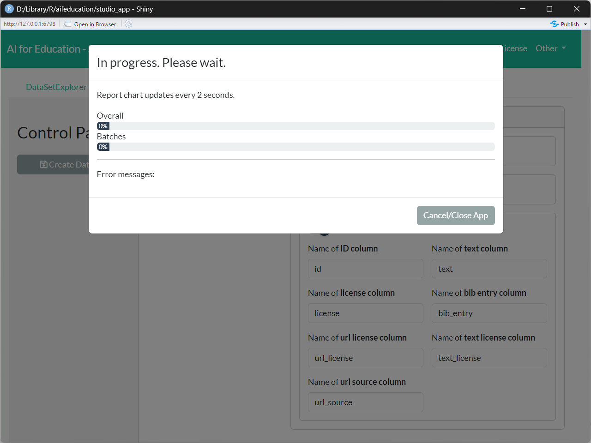
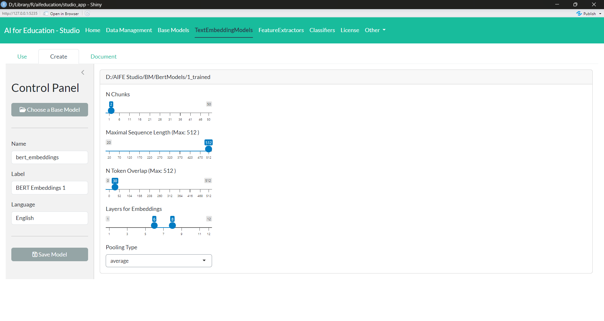
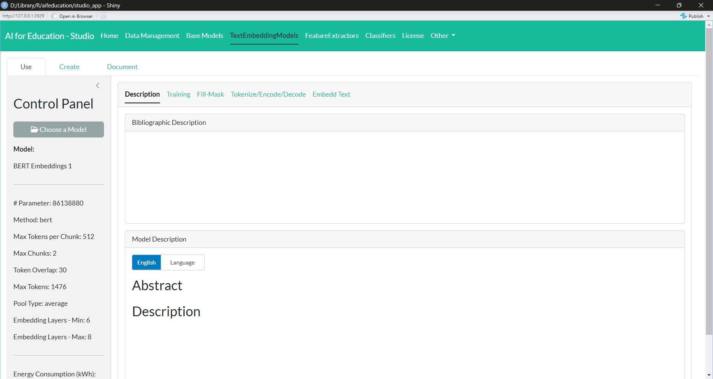
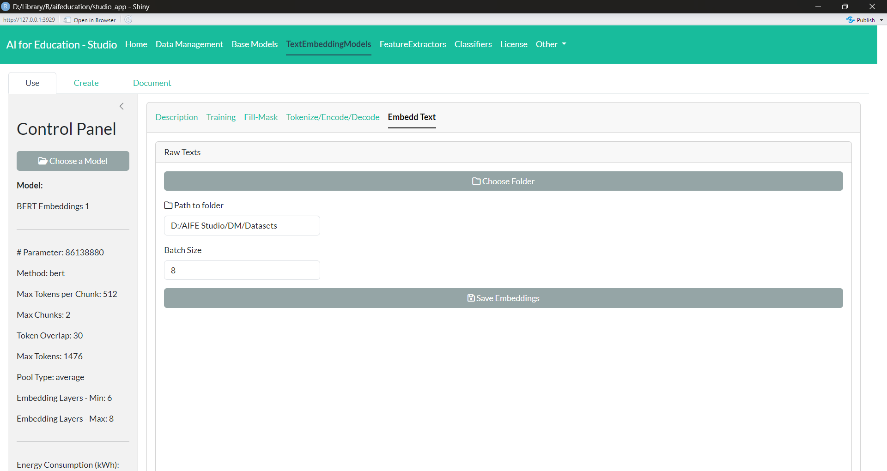
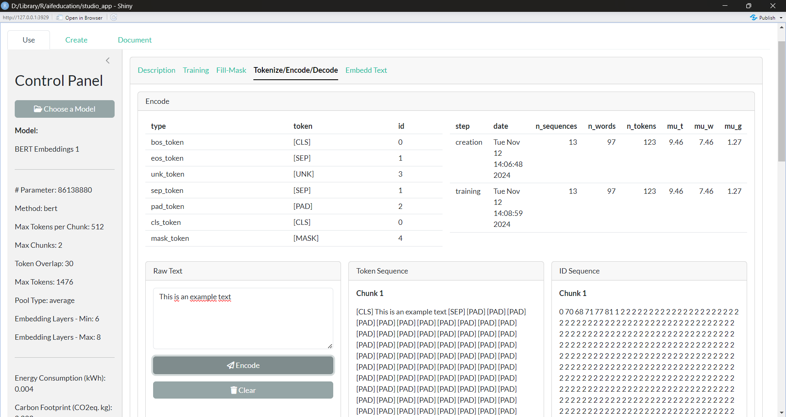
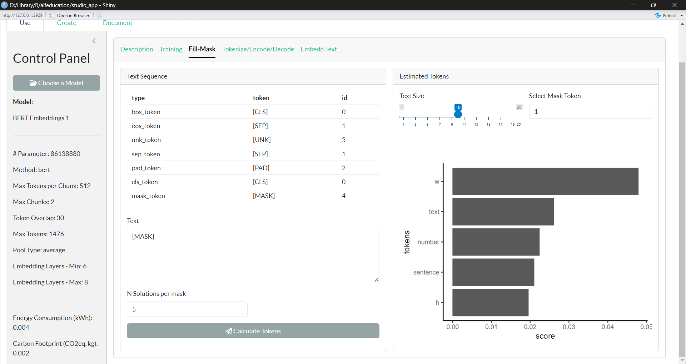
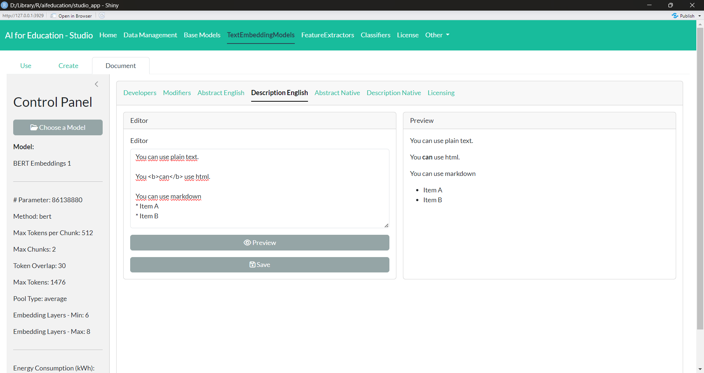

```{r, include = FALSE}
knitr::opts_chunk$set(
  collapse = TRUE,
  comment = "#>"
)
library(aifeducation)
```

# 1 Introduction and Overview

## 1.1 Preface

This vignette introduces *Aifeducation - Studio* which is a graphical
user interface for creating, training, documenting, analyzing, and
applying artificial intelligence (AI). It is made for users unfamiliar
with *R* or those who do not have coding skills in relevant languages
(e.g., python). For more experienced users, the interface provides a
convenient way for working with AI in an educational context.

This article overlaps with vignette 
[03 Using R syntax](classification_tasks.html),
which explains how to use the package
with *R* syntax. We assume that *aifeducation* is installed as described
in vignette 
[01 Get Started](https://fberding.github.io/aifeducation/articles/aifeducation.html).
The introduction starts with a brief explanation of basic concepts,
which are necessary to work with this package.

## 1.2 Basic Concepts

In the educational and social sciences, assigning an observation to
scientific concepts is an important task that allows researchers to
understand an observation, to generate new insights, and to derive
recommendations for research and practice.

In educational science, several areas deal with this kind of task. For
example, diagnosing students' characteristics is an important aspect of
a teachers' profession and necessary to understand and promote learning.
Another example is the use of learning analytics, where data about
students is used to provide learning environments adapted to their
individual needs. On another level, educational institutions such as
schools and universities can use this information for data-driven
performance decisions (Laurusson & White 2014) as well as where and how
to improve it. In any case, a real-world observation is aligned with
scientific models to use scientific knowledge as a technology for
improved learning and instruction.

Supervised machine learning is one concept that allows a link between
real-world observations and existing scientific models and theories
(Berding et al. 2022). For the educational sciences, this is a great
advantage because it allows researchers to use the existing knowledge
and insights to apply AI. The drawback of this approach is that the
training of AI requires both information about the real world
observations and information on the corresponding alignment with
scientific models and theories.

A valuable source of data in educational science are written texts,
since textual data can be found almost everywhere in the realm of
learning and teaching (Berding et al. 2022). For example, teachers often
require students to solve a task which they provide in a written form.
Students have to create a solution for the tasks which they often
document with a short written essay or a presentation. This data can be
used to analyze learning and teaching. Teachers' written tasks for their
students may provide insights into the quality of instruction while
students' solutions may provide insights into their learning outcomes
and prerequisites.

AI can be a helpful assistant in analyzing textual data since the
analysis of textual data is a challenging and time-consuming task for
humans.

> Please note that an introduction to content analysis, natural language
> processing or machine learning is beyond the scope of this vignette.
> If you would like to learn more, please refer to the cited literature.

Before we start, it is necessary to introduce a definition of our
understanding of some basic concepts, since applying AI to educational
contexts means to combine the knowledge of different scientific
disciplines using different, sometimes overlapping concepts. Even within
a single research area, concepts are not unified. Figure 1 illustrates
this package's understanding.

{width="100%"}

Since *aifeducation* looks at the application of AI for classification
tasks from the perspective of the empirical method of content analysis,
there is some overlapping between the concepts of content analysis and
machine learning. In content analysis, a phenomenon like performance or
colors can be described as a scale/dimension which is made up by several
categories (e.g. Schreier 2012, pp. 59). In our example, an exam's
performance (scale/dimension) could be "good", "average" or "poor". In
terms of colors (scale/dimension) categories could be "blue", "green",
etc. Machine learning literature uses other words to describe this kind
of data. In machine learning, "scale" and "dimension" correspond to the
term "label" while "categories" refer to the term "classes" (Chollet,
Kalinowski & Allaire 2022, p. 114).

With these clarifications, classification means that a text is assigned
to the correct category of a scale or, respectively, that the text is
labeled with the correct class. As Figure 2 illustrates, two kinds of
data are necessary to train an AI to classify text in line with
supervised machine learning principles.

{width="100%"}

By providing AI with both the textual data as input data and the
corresponding information about the class as target data, AI can learn
which texts imply a specific class or category. In the above exam
example, AI can learn which texts imply a "good", an "average" or a
"poor" judgment. After training, AI can be applied to new texts and
predict the most likely class of every new text. The generated class can
be used for further statistical analysis or to derive recommendations
about learning and teaching.

In use cases as described in this vignette, AI has to "understand"
natural language: „Natural language processing is an area of research in
computer science and artificial intelligence (AI) concerned with
processing natural languages such as English and Mandarin. This
processing generally involves translating natural language into data
(numbers) that a computer can use to learn about the world. (…)” (Lane ,
Howard & Hapke 2019, p. 4)

Thus, the first step is to transform raw texts into a a form that is
usable for a computer, hence raw texts must be transformed into numbers.
In modern approaches, this is usually done through word embeddings.
Campesato (2021, p. 102) describes them as "the collective name for a
set of language modeling and feature learning techniques (...) where
words or phrases from the vocabulary are mapped to vectors of real
numbers." The definition of a word vector is similar: „Word vectors
represent the semantic meaning of words as vectors in the context of the
training corpus." (Lane, Howard & Hapke 2019, p. 191). In the next step,
the words or text embeddings can be used as input data and the labels as
target data for training AI to classify a text.

In *aifeducation,* these steps are covered with three different types of
models, as shown in Figure 3.

{width="100%"}

-   **Base Models:** The base models are the models which contain the
    capacities to understand natural language. In general, these are
    transformers such as BERT, RoBERTa, etc. A huge number of
    pre-trained models can be found on
    [Huggingface](https://huggingface.co/).

-   **Text Embedding Models:** The modes are built on top of base models
    and store directions on how to use these base models for converting
    raw texts into sequences of numbers. Please note that the same base
    model can be used to create different text embedding models.

-   **Classifiers:** Classifiers are used on top of a text embedding
    model. They are used to classify a text into categories/classes
    based on the numeric representation provided by the corresponding
    text embedding model. Please note that a text embedding model can be
    used to create different classifiers (e.g. one classifier for
    colors, one classifier to estimate the quality of a text, etc.).

With the help of this overview we can start the introduction of
*Aifeducation Studio*.

# 2 Starting Aifeducation Studio

We recommend to start with a clean *R* session. Then you can start
Aifeducation Studio by entering the following into the console:

```{r, include = TRUE,eval=FALSE}
library(aifeducation)
start_aifeducation_studio()
```

Please note that this can take a moment.

At the beginning you will see the home page (Figure 4).

{width="100%"}

Here you cannot choose framework (*pytorch* is activated by default).

# 3 Using Aifeducation Studio

## 3.1 Preparing Data

### 3.1.1 Collection of Raw Texts

The fist step in working with AI is to gather and to structure data. In
the scope of *aifeducation,* data can be either a collection of raw
texts, sequences of numbers representing the texts (text embeddings) or
texts' labels.

Collections of raw texts are necessary in two cases: First, to train or
to fine-tune base models. Second, to transform texts into texts
embeddings which can be used as input for training a classifier or for
predicting the texts' labels via classifier.

To create a collection of raw texts, you have to choose the 
*Data Management* page on the top panel as shown in Figure 5. 

{width="100%"} 

On the
resulting page (see Figure 6), you first have to choose the directory where the texts
are stored (box *Text Sources*). We recommend that you store all texts you would
like to use in a single folder. Within this folder, you can structure
your data with sub-folders.

{width="100%"}

In the next step, you can decide which file formats should be included
(box *File Types*). Currently, *aifeducation* supports .txt, .pdf, and .xlsx
files. If enabled, all files of the requested file format are included
in your data collection.

**.txt files**

The first alternative is to store raw texts in .txt files. To use these
you have to structure your data in a specific way:

- Create a main folder for storing your data.
- Store every raw text/document into a *single* .txt file into its *own* folder within the main folder. In
  every folder there should be only one file for a raw text/document.
- Add an additional .txt file to the folder named `bib_entry.txt`. This file contains
  bibliographic information for the raw text.
- Add an additional .txt file to the folder named `license.txt` which contains 
  a short statement for the license of the text such as "CC BY".
- Add an additional .txt file to the folder named `url_license.txt` which contains 
  the url/link to the license' text such as "https://creativecommons.org/licenses/by/4.0/".
- Add an additional .txt file to the folder named `text_license.txt` which contains 
  the full license in raw texts.
- Add an additional .txt file to the folder named `url_source.txt` which contains 
  the url/link to the text file in the internet.
  
Applying these rules may result in a data structure as follows:

- Folder "main folder"
  - Folder Text A
    - text_a.txt
    - bib_entry.txt
    - license.txt
    - url_license.txt
    - text_license.txt
    - url_source.txt
  - Folder Text B
    - text_b.txt
    - bib_entry.txt
    - license.txt
    - url_license.txt
    - text_license.txt
    - url_source.txt
  - Folder Text C
    - text_c.txt
    - bib_entry.txt
    - license.txt
    - url_license.txt
    - text_license.txt
    - url_source.txt

Please note, that adding
a `bib_entry.txt`, `license.txt`, `url_license.txt`, `text_license.txt`, and `url_soruce.text` 
to every folder is optional. If there is no 
such a file in the corresponding folder there will be an empty entry in the data set.
However, against the backdrop of the European AI Act we recommend to provide
license  and bibliographic information to make the documentation of your models
more straightforward. Furthermore, some license such as the licenses provides by
Creative Commons require statements about the creators, a copyright notice, an url or link
to the source material (if possible), the license of the material and an url or link
to the license's text in the internet or the license text itself. Please check the licenses 
of the material your are using for the requirements. 

**.pdf files**

The second alternative is to use .pdf files as source for raw texts. Here the 
necessary structure is similar to .txt files.

Please not that all files except the text file must be .txt, not .pdf.

As stated above `bib_entry.txt`, `license.txt`, `url_license.txt`, `text_license.txt`, and `url_soruce.text` are optional.

**.xlsx files**

The third alternative is to store the raw texts into .xlsx files. This alternative
is practicable if you have many small raw texts. For raw texts that are very large such
as books or papers we recommend to store them as .txt or .pdf files.

In order to add raw texts from .xlsx files the files need a special structure:

- Create a main folder for storing all .xlsx files you would like to read.
- All .xlsx files must contain the names of the columns in the first row (Figure 7) and
  the names must be identical for each column across all .xslx files you would like
  to read. 
- Every .xslx files must contain a column storing the text id and must contain
  a column storing the raw text. Every text must have a unique id across all
  .xlsx files.
- Every .xslx file can contain an additional column for the bib entry.
- Every .xslx file can contain an additional column for the license.
- Every .xslx file can contain an additional column for the license's url.
- Every .xslx file can contain an additional column for the license's text.
- Every .xslx file can contain an additional column for the source's url.

Your .xlsx file may look like

|id |text|bib|license|url_license|text_license|url_source|
|---|---|---|---|---|---|---|
|z3   |This is an example.   |Author (2019)   |CC BY   |Example url  |Text | Example url|
|a3   |This is a second example.   |Author (2022)   |CC BY   |Example url| Text | Example url|
|...   |...   |...   |...   |   | | |

{width="75%"}

The last step is to choose a folder where your collection of raw texts
should be saved. Please select a path and a folder name for your LargeDataSet
(*Create Data Set* button on the *Control Panel*) (Figure I). With *Directory* field you
specify the location where to save the object and with *Folder Name* field you define the
name of the folder that will be created within that directory. In this folder the data set is saved.

{width="100%"}

Finally, you can start creating the collection (*Continue* button in Figure I). Please note
that this can take some time. Creation progress you can see in the progress bars (Figure II).

{width="100%"}

When the process finishes you can see message like in Figure III (in the case if
the process has completed without any errors).

{width="100%"}

You have a folder with the files that can be used for
further tasks like creation and training/tuning the transformers (*Base Models* tab on the top panel), etc.
The object contains a `dataset` that stores the
texts together with their IDs. In case of .xlsx files, the texts' IDs
are set to the IDs stored in the corresponding column for ID. In the
case of .pdf and .txt files, the file names are used as ID (without the
file extension, see Figure 8).

{width="75%"}

> Please note that a consequence of this is that two files *text_01.txt*
> and *text_01.pdf* have the same ID, which is not allowed. Please
> ensure that you use unique IDs across file formats.

The IDs are very important since they are used to match the
corresponding class/category if available.

### 3.1.2 Collections of Texts' Labels

Labels are necessary if you would like to train a classifier. The
easiest way is to create a table that contains a column for the texts'
ID and one or multiple columns that contain the texts'
categories/classes. Supported file formats are .xlsx, .csv, and
.rda/.rdata. Figure 9 illustrates an example for a .xslx file.  

{width="50%"}

> In any case, the table must contain a column with the name "id" which
> contains the texts' IDs. All other columns must also have unique
> names. Please pay attention to use "id" and not "ID" or "Id".

## 3.2 Base Models

### 3.2.1 Overview

Base models are the foundation of all further models in *aifeducation*.
At the moment, these are transformer models such as BERT (Devlin et al.
2019), RoBERTa (Liu et al. 2019), DeBERTa version 2 (He et al. 2020),
Funnel-Transformer (Dai et al. 2020), Longformer (Beltagy, Peters &
Cohan 2020), and MPNet. In general, these models are trained on a large corpus of
general texts in the first step. In the next step, the models are
fine-tuned to domain-specific texts and/or fine-tuned for specific
tasks. Since the creation of base models requires a huge number of texts
resulting in high computational time, it is recommended to use
pre-trained models. These can be found on
[Huggingface](https://huggingface.co/). Sometimes, however, it is more
straightforward to create a new model to fit a specific purpose.
Aifeducation Studio supports the opportunity to both create and
train/fine-tune base models.

### 3.2.2 Creation of Base Models

In order to create a new base model you have to choose the option (tab)
*Create* on the tab *Base Models* on the top panel of the
app (Figure 5). Figure 10 shows the corresponding page.

[{width="100%"}](img_articles/gui/BM_Create_Fill_fields.png)
Figure 10: Base Models - Create Transformer (click image to enlarge)

Every transformer model is composed of two parts: 1) the tokenizer which
splits raw texts into smaller pieces to model a large number of words
with a limited, small number of tokens and 2) the neural network that is
used to model the capabilities for understanding natural language.

At the beginning you can choose between the different supported
transformer architectures (*Base Architecture* combobox in the section 
*Model-based parameters* of the box *Model Architecture*).
Depending on the architecture, you
have different options determining the shape of your neural network.
You also have independent (general) options for all the transformers
(box *General parameters*).

In the right-bottom side of the box *Model Architecture*, you find a box 
named *Vocabulary*. Here you must provide
the path to a folder which contains files with a data for LargeDataSet. This data set is
used to calculate the vocabulary of the transformer.
This file should be created with *Aifeducation Studio* (tab *Data Management*) to ensure
compatibility. See section 3.1.1 for more details. It is very important
that you provide a number of how many tokens the vocabulary should
include. Depending on the transformer method, you can set
additional options affecting a transformer's vocabulary.

-   **Transform to Lower:** If this option is enabled, all words in a
    raw text are transformed to lower cases. For instance, the resulting
    token of *Learners* and *learners* are the same. If disabled,
    *Learners* and *learners* will have a different tokenization.

-   **Add Prefix Spaces:** If enabled, a space is added to the first
    word if there is not already one. Thus, enabling this option leads
    to a similar tokenization for the word *learners* in both cases: 1)
    "*learners* need a high motivation for high achievement." and 2) "A
    high motivation is necessary for *learners* to achieve high
    performance.".

-   **Trim Offsets:** If this option is enabled, the white spaces of the
    produced offsets are trimmed.

The last step is to choose a folder where the new base model should be
saved (*Choose Folder* button on the *Control Panel*). Finally, you can start the creation of your model by
clicking on the button "Start Creation". The creation of the model may
take some time. You can see the progress of a creation with progress bars.

### 3.2.3 Train/Tune a Base Model

If you would like to train a new base model (see section 3.2.2) for the
first time or want to adapt a pre-trained model to a domain-specific
language or task, you have to click on *Train* section on the *Base Models* tab.

[{width="100%"}](img_articles/gui/BM_Train_Fill_fields.png)
Figure 11: Base Models - Train/Tune Transformer (click image to enlarge)

In the first step, you have to choose the base model you would like to
train/tune (box *Base Model*). Please note that every base model consists of several files.
Thus, you cannot provide neither single nor multiple files. Instead you
have to provide the folder that stores the entire model.

Compatible models are all base models that you have created with
*Aifeducation Studio*. In addition you can use any model from
[Huggingface](https://huggingface.co/) that uses an architecture
implemented in *aifeducation* such as BERT, DeBERTa, etc.

After choosing a base model, new boxes appear as shown in Figure 11. To
train a model, you must first provide a folder to a dataset (collection of raw texts) (box *Dataset*).
We recommend that you create this collection of texts as described
in section 3.1.1.

Next you can configure the training of your base model (box *Train and Tune Settings*).
Possible options depend on the kind of model.

-   **Chunk Size:** For training and validating a base model, the raw
    texts are split into several smaller texts. This value determines
    the maximum length of these smaller text pieces in number of tokens.
    This value cannot exceed the maximum size set during creation of the
    base model.

-   **Minimal Sequence Length:** This value determines the minimal
    length of a text chunk in order to be part of the training and
    validation data.

-   **Full Sequences Only**: If this option is enabled, only text chunks
    with a number of tokens equal to "chunk size" are included in the
    data. Disable this option if you have a lot of small text chunks you
    would like to use for training and validation.

-   **Probability of Token Masking:** This option determines how many
    tokens of every sequence should be masked.
    
-   **Probability of Token Permutation:** This option determines how many
    tokens of every sequence are used for permutation.
    
-   **Whole Word Masking:** If this option is activated, all tokens
    belonging to a single word are masked. If this options is disabled
    or not available token masking is used.

-   **Validation Size:** This option determines how many sequences
    should be used for validating the performance of the base model.
    Sequences used for validation are not available for training.

-   **Batch Size:** This option determines how many sequences should be
    processed at the same time. Please adjust this value to the
    computation capacities of your machine.

-   **n Epochs:** The maximum number of epochs for training. During
    training, the model that has the best validation loss is saved on
    disk an will be used for the final model.

-   **Learning Rate:** The initial learning rate.

In the last step, you have to provide the directory where your trained
model should be saved after training (*Choose Folder* button on the *Control Panel*).
The corresponding folder
will also contain the checkpoints during training. It is very important
that this directory is not the same directory as the one you stored the
original model in. By clicking the button "Start Training/Tuning", the
training starts. Please note that the training of a base model can last
days or even weeks, depending on the size and the kind of model, the
amount of data, and the capacities of your machine. You can see the training 
progress with the progress bars and plot (Figure IIII).

{width="100%"}

## 3.3 Text Embedding Models

### 3.3.1 Create a Text Embedding Model

The text embedding model is the interface to *R* in *aifeducation*. In
order to create a new model, you need a base model that provides the
ability to understand natural language. This object contains all relevant
information for transforming raw texts into a numeric representation
that can be used for machine learning.

In *aifedcuation*, the transformation of raw texts into numbers is a
separate step from downstream tasks such as classification. This is to
reduce computational time on machines with low performance. By
separating text embedding from other tasks, the text embedding has to be
calculated only once and can be used for different tasks at the same
time. Another advantage is that the training of the downstream tasks
involves only the downstream tasks an not the parameters of the
embedding model, making training less time-consuming, thus decreasing
computational intensity. Finally, this approach allows the analysis of
long documents by applying the same algorithm to different parts.

You can open the creation page
by clicking on "Create" in the section "Text Embedding Model" 
via "Language Modeling" (see Figure 5). Figure 12 shows the corresponding page.

[{width="100%"}](img_articles/gui/TEM_Create_Fill_fields.png)
Figure 12: Text Embedding Model - Create (click image to enlarge)

First you have to choose the base model that should form the foundation
of your new text embedding model. Please select the folder that contains
the entire model and not single files (box *Base Model*).

After choosing a model, new boxes appear which allow you to customize
your interface (box *Interface Setting*). Here it is very important that
you give your model a unique name and label. The difference between
*Name* and *Label* is that *Name* is used for the computer and *Label*
for users. Thus, *Name* should not contain any spaces or special
characters. *Label* does not have any restrictions. Think of *Label* as
the title of a book or paper. With *Version* you can provide a version
number if you create a newer version of your model. In case you create a
new model, we recommend to use "0.0.1". For *Language,* it is necessary
that you choose which language your model is created for, such as
English, French, German, etc.

On the right side of the box *Interface Setting* you can set how the interface
should process raw text:

-   **N chunks:** Sometimes texts are very long. With this value, you
    can decide into how many chunks longer texts should be divided. The
    maximum length of every chunk is determined by the value provided at
    "Maximum Sequence Length".

-   **Maximal Sequence Length:** This value determines the maximum
    number of tokens your model processes for every chunk.

-   **N Token Overlap:** This value determines how many tokens form the
    prior chunk should be included in the current chunk. An overlap can
    be useful to provide the correct context for every chunk.

-   **Layers for Embeddings - Min**: Base models transform raw data into a
    sequence of numbers by using the different layers' hidden states. With this 
    option you can decide which is the first layer to use. 
    
-   **Layers for Embeddings - Max**: With this option you can decide which is the last layer
    to use. The hidden states of all layers between min and max are averaged to form
    the embedding of a text chunk.
    
-   **Pooling Type**: With this option you can decide if only the hidden states of
    the cls-token should be used for the embedding. If you set thisn option to
    "average" the hidden states of all tokens are averaged within each layer except
    the hidden states for padding tokens.

The maximum number of tokens your model can process and provide for
downstream tasks can be calculated as 
$$Max Tokens = NChunks*MaximalSequenceLength-(NChunks-1)*NOverlap$$ 
If the text is longer, the remaining tokens are ignored and lost for
further analysis.

> Please note that you can create multiple text embedding models with a
> different configuration based on the same base model.

The last step is to provide and name a folder to save the model to
(box *Creation*).

### 3.3.2 Using a Text Embedding Model

Using a text embedding model is a central aspect of applying artificial
intelligence in *aifeducation*. The corresponding page can be found by
clicking on "Use" in the tab "Language Modeling". At the start you have
to choose the model that you would like to use. Please select the folder
that contains the entire model instead of selecting single files. After
selecting and loading a model, a new box appears that shows you the
different aspects of the model and how you can use it.

The tab *Model Description* (Figure 13) provides you with the documentation of the
model.

[{width="100%"}](img_articles/gui/TEM_Use_Fill_fields.png)
Figure 13: Text Embedding Model - Description (click image to enlarge)

The tab *Training* shows the development of the loss and the validation loss
during the last training of the corresponding base model. If no plot is displayed no 
history data is available.

The tab *Create Text Embeddings* (Figure 14) allows you to transform raw texts into
a numerical representation of these texts, called text embeddings. These
text embeddings can be used in downstream tasks such as classifying
texts. In order to transform raw texts into embedded texts, you first
have to select a collection of raw texts. We
recommend that you create this collection according to section 3.1.1.
Next you have to provide the folder where the embeddings should be
stored and name it. With *Batch Size* you can determine how
many raw texts should be processed simultaneously. Please adjust this
value to your machine's capacities. By clicking on the button "Start
Embed" the transformation of texts begins.

[{width="100%"}](img_articles/gui/TEM_Use_Embedd_text.png)
Figure 14: Text Embedding Model - Embeddings (click image to enlarge)

The tab *Encode/Decode/Tokenize* (Figure 15) offers you insights into the way your
text embedding model processes data. In the box *Encode* you can insert
a raw text and after clicking on *Encode* you can see how the text is
divided into tokens and their corresponding IDs. The IDs are passed to
the base model and are used to generate the numeric representation of a
text. The box *Decode* allows you to reverse this process. There you can
insert a sequence of numbers (separated with a comma or with spaces) and
after clicking on *Decode,* the corresponding tokens and the raw text
appear.

[{width="100%"}](img_articles/gui/TEM_Use_TED_Encode.png)
Figure 15: Text Embedding Model - Encode/Decode/Tokenize (click image to enlarge)

Finally, the tab *Fill Mask* (Figure 16) allows you to request the underlying base
model of your text embedding model to calculate a solution to a
fill-in-the-blank text. In the box *Text* you can insert a raw text. A
gap is signaled by insert the corresponding masking token. This token
can be found in the table above in the row for "mask_token". If you
insert a gap/mask_token please ensure correct spelling. With "N
Solutions per Mask*"* you can determine how many tokens the model should
calculate for every gap/mask_token. After clicking "Calculate Tokens",
you will find an image on the right side of the box, showing you the
most reasonable token for the selected gap. The tokens are ordered by
certainty; from the perspective of the model, the most reasonable tokens
are at the top and the less reasonable tokens are at the bottom.

[{width="100%"}](img_articles/gui/TEM_Use_Fill_mask.png)
Figure 16: Text Embedding Model - Fill Mask (click image to enlarge)

### 3.3.3 Documenting a Text Embedding Model

Creating "good" AI models requires a lot of effort. Thus, sharing work
with other users is very important to support progress in a discipline.
Thus, meaningful documentation is required. In addition, a well written
documentation makes an AI model more transparent, allowing others to
understand how the AI model generated a solution. This is also very
important in order to judge the limitations of a model.

To support developers in documenting their work, *Aifeducation Studio*
provides an easy way to add a comprehensive description. You find this
part of the app by clicking on "Document" in the tab *Language
Modeling*. First, you have to choose the text embedding model you would
like to document (not the base model!).

After choosing a model, a new box appears, allowing you to insert the
necessary information. Via the tabs *Developers* and *Modifiers,* you
can provide the names and email addresses of all relevant contributors.
*Developers* refer to the people who created a model, while *Modifiers*
refers to the people who adapted a pre-trained model to another domain or
task.

[{width="100%"}](img_articles/gui/TEM_Document_Desc_english.png)
Figure 17: Text Embedding Model - Documentation (click image to enlarge)

In the tabs *Abstract* and *Description*, you can provide an abstract
and a detailed description of your work in English and/or in the native
language of your text embedding model (e.g., French, German, etc.),
allowing you to reach a broader audience (Figure 17). In all four tabs you can
provide your documentation in plain text, html, and/or markdown allowing
you to insert tables or to highlight parts of your documentation. If you
would like to see what your documentation will look like on the
internet, you can click on the button "Preview". Saving your changes is
possible by clicking on *Save*.

> For more information on how to document your model, please refer to
> the vignette [03 Sharing and Using Trained AI/Models](sharing_and_publishing.html).

## 3.4 Classifiers

### 3.4.1 Create a Classifier

Classifiers are built on top of a text embedding model. To create a
classifier, click on "Create and Train" in the tab *Classification* (see Figure 5).
Figure 18 shows the corresponding page.

[{width="100%"}](img_articles/gui_aife_studio_classifier_create_part_1.jpg)
Figure 18: Classifier - Creation Part 1 (click image to enlarge)

Creating a classifier requires two kinds of data. First, a text
embedding of a collection of texts. These embeddings should be created
with a text embedding model as described in section 3.3.2. Second, a
table with the labels of every text. This kind of data should be created
as described in section 3.1.2.

You can provide the text embeddings by opening the corresponding file in
the first box (*Input Data*). After selecting the embeddings, you will see a
summary of the underlying text embedding model that generated the
embeddings. In addition, you can see how many documents are in the file.

> Please note that the classifier is bound to the text embedding model
> that generated the embeddings. That is, the classifier can only be
> used if you have access to the corresponding text embedding model. The
> text embedding model is necessary to transform raw texts into a format
> that the classifier can understand.

In the second box (*Target Data*), you can select the file that contains the
corresponding labels. After loading the file, you can select
the column of the table that you would like to use as target data for
training. In addition, you can see a short summary of the absolute
frequencies of the single classes/categories.

> Please note that you can create multiple classifiers for different
> target data based on the same text embedding model. Thus, there is no
> need to create a new text embedding model for a new classifier. In
> particular, you can use the same text embeddings for training
> different classifiers.

In the third box (*Architecture*) you create the architecture of your neural network
(Figure 19). It is very important that you provide the model's name and label in the
section *General*. The *Model Name* is used for internal purposes by the
machine while the *Model Label* is used as a title of your classifiers
for other users. Thus, the *Model Name* should not contain any spaces or
special characters. For *Model Label,* there are no restrictions.

[{width="100%"}](img_articles/gui_aife_studio_classifier_create_part_2.jpg)
Figure 19: Classifier - Creation Part 2 (click image to enlarge)

To expand the different sections you can click on the "+" on the right
side, since a detailed explanation of every option is beyond the scope
of this introduction. Here we can only provide an overview.

-   **Positional Embedding:** By activating this option, you add
    positional embedding to your classifier. This provides the neural
    network with the ability to take the order within a sequence into
    account.
    
-   **Encoding Layers:** These layers are similar to encoding layers
    used in some transformer models, allowing to calculate
    context-sensitive text embeddings. That is, they provide your
    classifier with the ability to take the surrounding text chunks (see
    section 3.3.1) of the sequences into account.
    
-   **Recurrent Layers:** This section allows you to add recurrent
    layers to your classifier. These layers are able to account for the
    order within a sequence. In order to add these layers, just pass the
    numbers to the input field *Reccurent Layers* and separate them with
    a comma or space. Every number represents a layer and the number
    determines the number of neurons. Below the field you can see what
    *Aifeducation Studio* does with your input. This is helpful to avoid
    invalid specifications of layers.
    
-   **Dense Layers:** In this section you can add dense layers to your
    network. The process to add layers is similar to the process of
    recurrent layers.
    
-   **Optimizer:** Here you can choose between different optimizers for
    training.

The next box (*Training Settings*) contains the setting for training your classifier
(Figure 19). Going into detail is again beyond the scope of this introduction. Here we can
only provide an overview.

**Section: General Setting**

-   **Balance Class Weights**: If this option is enabled, the loss is
    adjusted to the absolute frequencies of the classes/categories
    according to the 'Inverse Class Frequency' method. This option
    should be activated if you have to deal with imbalanced data.
    
-   **Balance Sequence Length**: Activating this
    option can increase performance if you have to deal with texts that
    differ in their lengths and have an imbalanced frequency. If this option is 
    enabled, the loss is adjusted to the absolute frequencies of length of your texts
    according to the 'Inverse Class Frequency' method. 
    
-   **Number of Folds:** The number of folds used for estimating the
    performance of your classifier.
    
-   **Proportion for Validation Sample:** The percentage of cases within
    each fold used as a validation sample. This sample is used to
    determine the state of the model that generalizes best.
    
-   **Epochs:** Maximal number of epochs. During training, the model
    with the best balanced accuracy is saved and used.
    
-   **Batch Size:** The number of cases that should be processed
    simultaneously. Please adjust this value to your machine's
    capacities. Please note that the batch size can have an impact on
    the classifier's performance.

**Section: Synthetic Cases**

-   **Add Synthetic Cases:** If active, the creation of additional
    synthetic cases is applied during training. They are added to the train
    data. The way these cases are generated can be configured with the
    following parameters:
    
-   **Method:** The method which should be used for generating the
    cases.
    
-   **Min k:** The minimal number of neighbors used for generating
    the synthetic cases.
    
-   **Max k:** The maximum number of neighbors used for generating
    the synthetic cases. 

The algorithm will generate a number of synthetic cases for every class to ensure
that the number of cases for every class equals the number of cases of the majority 
class. The synthetic cases for every class a generated for all *k* between *Min k* and
*Max k*. Every *k* contributes proportional to the synthetic cases.


**Section: Pseudo-Labeling**

-   **Add Pseudo Labeling:** If activated, pseudo-labeling is used
    during training as described by Cascante-Bonilla et
    al. (2020). The way pseudo-labeling is applied can be
    configured with the following parameters:

-   **Max Steps:** The number of steps during pseudo-labeling. For
    example, in the first step, 1/Max Steps pseudo-labeled cases are
    added, in the second step, 2/Max Steps pseudo-labeled cases are
    added, etc.. Which cases are added can be influenced by *Balance
    Pseudo-Labels*, *Certainty Anchor*, *Max Certainty Value*, and
    *Min Certainty Value*.

-   **Certainty Anchor:** This value determines the reference point
    for choosing pseudo-labeled cases. 1 refers to perfect
    certainty, 0 refers to a certainty similar to random guessing.
    Selected are the cases that are closest to this value.

-   **Max Certainty Value:** Pseudo-labeled cases exceeding this
    value are not included during training.

-   **Min Certainty Value:** Pseudo-labeled cases falling bellow
    this value are not included during training.

We recommend to use pseudo-labeling as described by Cascante-Bonilla et
al. (2020). Therefore, the following parameters have to be set:

-   Max Steps = 5 
-   Max Certainty Value=1.00 
-   Certainty Anchor=1.00
-   Min Certainty Value=0.00


[{width="100%"}](img_articles/gui_aife_studio_classifier_create_part_3.jpg)
Figure 20: Classifier - Creation Part 3 (click image to enlarge)

In the last box (Figure 20), you have to provide the directory where you would like
to save the model. The name of the folder created within that directory can
be set with *Folder Name*.

Before you start training, you can check how many cases can be matched
between the text embeddings and the target data by clicking on the
button *Test Data Matching* (box *Model Saving*). This allows you to check if the structure
of the data is working. If everything is okay you can start training the
model by clicking on *Start Training*. Please note that training a
classifier can take up to several hours.

### 3.4.2 Using a Classifier

In case you have trained a classifier or are using a classifier trained
by other users, you can analyze the model's performance or use the model
to classify new texts. To do so, you have to select "Use" in the tab
*Classification*.

Similar to the other functions of this app, you first have to select the
classifier by providing the folder that contains the entire model.
Please note that a classifier is made up of several files. Thus,
*Aifeducation Studio* asks you to select the folder containing these
files and not single files. After loading a classifier, a new box
appears.

In the first tab, *Model Description*, (Figure 21) you will find the documentation
of the model.

[{width="100%"}](img_articles/gui_aife_studio_classifier_use_desc.jpg)
Figure 21: Classifier - Description (click image to enlarge)

In the second tab, *Training* (Figure 22) you receive a summary of the training
process of the model. This includes a visualization of the loss, the
accuracy, and the balanced accuracy for every fold and every epoch.
Depending on the applied training techniques (such as *Balanced
Pseudo-Labeling*), you can request additional images.

[{width="100%"}](img_articles/gui_aife_studio_classifier_use_train.jpg)
Figure 22: Classifier - Training (click image to enlarge)

The third tab, *Reliability*, (Figure 23) provides you with information on the
quality of the model. Here you find visualizations giving you insights
into how the classifier is able to generate reliable results. In
addition, measures from content analysis as well as machine learning
allow you to analyze specific aspects of the model's performance.

[{width="100%"}](img_articles/gui_aife_studio_classifier_use_reliability.jpg)
Figure 23: Classifier - Reliability (click image to enlarge)

The last tab, *Prediction* (Figure 24) allows you to apply a trained model to new
data. Here you can use the trained model to assign classes/categories to
new texts. For this purpose, you must first provide the file that
contains the text embeddings of the documents you would like to
classify. You can create these embeddings with the text embedding model
used for providing the training data of the classifier. The necessary
steps are described in section 3.3.2.

[{width="100%"}](img_articles/gui_aife_studio_classifier_use_predictions.jpg)
Figure 24: Classifier - Prediction (click image to enlarge)

> These embeddings must be created with the same text embedding model
> that created the text embeddings for training. If not, an error will
> occur. See section 3.4.1 and 3.3.2 for more details.

The next step is to provide the folder where you would like to save the
predictions and to provide a file name. The default case is to store the
predictions in an .rda file, allowing you to load the data directly into
*R* for further analysis. However, you can additionally save the results
in a .csv file, allowing you to export the predictions to other
programs. The resulting data table may look like shown in Figure 25.

[{width="100%"}](img_articles/gui_aife_studio_classifier_predictions.jpg)
Figure 25: Classifier - Prediction Results (click image to enlarge)

### 3.4.3 Documenting a Classifier

Documenting a classifier is similar to the documentation of a text
embedding model (section 3.3.3, see Figure 18).

To support developers in documenting their work, *Aifeducation Studio*
provides an easy way to add a comprehensive description. You find this
part of the app by clicking on "Document" in the tab *Classification*.
First, you have to choose the classifier you would like to document.

After choosing a model, a new box appears, allowing you to insert the
necessary information. Via the tab *Developers,* you can provide the
names and email addressees of all relevant contributors.

In the tabs *Abstract* and *Description,* you can provide an abstract
and a detailed description of your work in English and/or in the native
language of your classifier (e.g., French, German, etc.), allowing you
to reach a broader audience. In all four tabs you can provide your
documentation in plain text, html, and/or markdown allowing you to
insert tables or to highlight parts of your documentation. If you would
like to see what your documentation will look like on the internet, you
can click on the button "Preview". Saving your changes is possible by
clicking on *Save*

> For more information on how to document your model, please refer to
> the vignette [03 Sharing and Using Trained
> AI/Models](sharing_and_publishing.html).

# References

Beltagy, I., Peters, M. E., & Cohan, A. (2020). Longformer: The
Long-Document Transformer. <https://doi.org/10.48550/arXiv.2004.05150>

Berding, F., Riebenbauer, E., Stütz, S., Jahncke, H., Slopinski, A., &
Rebmann, K. (2022). Performance and Configuration of Artificial
Intelligence in Educational Settings.: Introducing a New Reliability
Concept Based on Content Analysis. Frontiers in Education, 1--21.
<https://doi.org/10.3389/feduc.2022.818365>

Campesato, O. (2021). Natural Language Processing Fundamentals for
Developers. Mercury Learning & Information.
<https://ebookcentral.proquest.com/lib/kxp/detail.action?docID=6647713>

Cascante-Bonilla, P., Tan, F., Qi, Y. & Ordonez, V. (2020). Curriculum
Labeling: Revisiting Pseudo-Labeling for Semi-Supervised Learning.
<https://doi.org/10.48550/arXiv.2001.06001>

Chollet, F., Kalinowski, T., & Allaire, J. J. (2022). Deep learning with
R (Second edition). Manning Publications Co.
<https://learning.oreilly.com/library/view/-/9781633439849/?ar>

Dai, Z., Lai, G., Yang, Y. & Le, Q. V. (2020). Funnel-Transformer:
Filtering out Sequential Redundancy for Efficient Language Processing.
<https://doi.org/10.48550/arXiv.2006.03236>

Devlin, J., Chang, M.‑W., Lee, K., & Toutanova, K. (2019). BERT:
Pre-training of Deep Bidirectional Transformers for Language
Understanding. In J. Burstein, C. Doran, & T. Solorio (Eds.),
Proceedings of the 2019 Conference of the North (pp. 4171--4186).
Association for Computational Linguistics.
<https://doi.org/10.18653/v1/N19-1423>

He, P., Liu, X., Gao, J. & Chen, W. (2020). DeBERTa: Decoding-enhanced
BERT with Disentangled Attention.
<https://doi.org/10.48550/arXiv.2006.03654>

Lane, H., Howard, C., & Hapke, H. M. (2019). Natural language processing
in action: Understanding, analyzing, and generating text with Python.
Shelter Island: Manning.

Larusson, J. A., & White, B. (Eds.). (2014). Learning Analytics: From
Research to Practice. New York: Springer.
<https://doi.org/10.1007/978-1-4614-3305-7>

Liu, Y., Ott, M., Goyal, N., Du, J., Joshi, M., Chen, D., Levy, O.,
Lewis, M., Zettlemoyer, L., & Stoyanov, V. (2019). RoBERTa: A Robustly
Optimized BERT Pretraining Approach.
<https://doi.org/10.48550/arXiv.1907.11692>

Schreier, M. (2012). Qualitative Content Analysis in Practice. Los
Angeles: SAGE.
