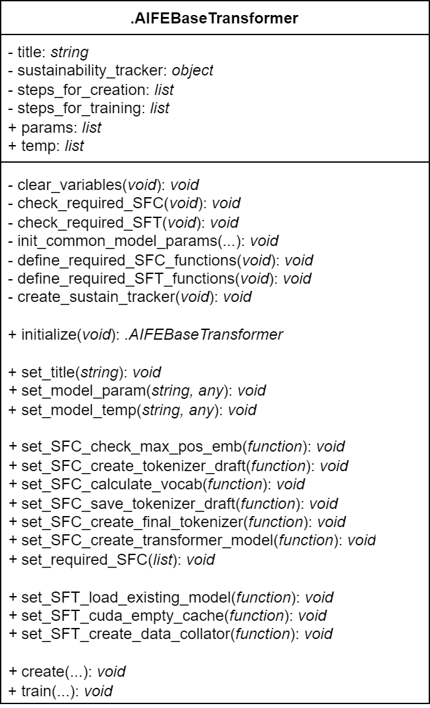
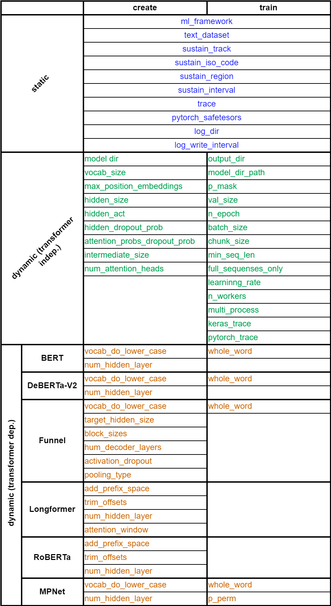
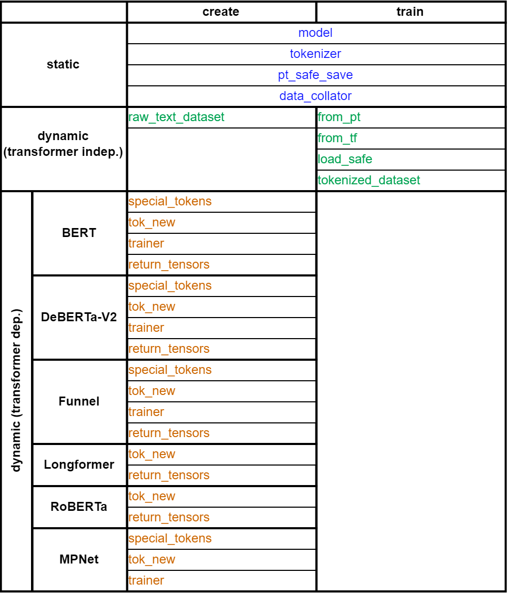
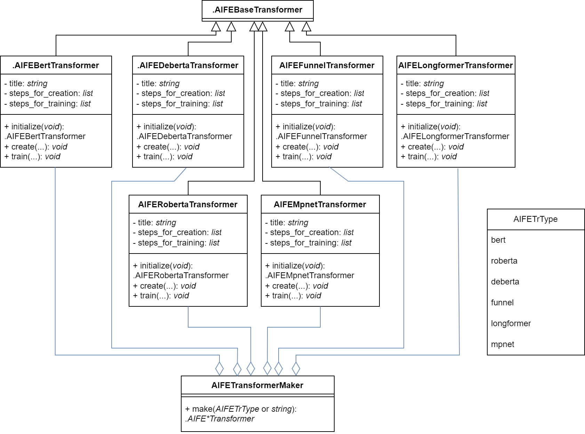

```{r, include = FALSE}
knitr::opts_chunk$set(
  collapse = TRUE,
  comment = "#>"
)
library(aifeducation)
```

# 1 Base Transformer Class

## 1.1 Overview

See [Base Transformer Class Documentation](https://fberding.github.io/aifeducation/reference/dot-AIFEBaseTransformer.html) for details.

UML-diagram of Base Transformer Class:

{width="50%"}

This class has:

-   private attributes: `title`, `sustainability_tracker`,
    `steps_for_creation` and `steps_for_training` (see p. 1.2 Private
    attributes).

-   public attributes: `params` and `temp` lists (see p. 1.3 Public
    attributes).
    
-   private methods:
    +   `clear_variables` method sets the `params`, `temp` and 
        `sustainability_tracker` attributes to `NULL`.
        
    +   `check_required_SFC` and `check_required_SFT` methods check the 
        required steps (functions) in SFC and SFT lists for `NULL` respectively. 
        Steps set to `NULL` by default and must be functions.
    
    +   `init_common_model_params` method contains `set_model_params` method
        calls to set common model's parameters (listed as 'static'
        parameters in p. 1.3 Public attributes -> `param` list).
    
    +   `define_required_SFC_functions` and `define_required_SFT_functions`
        methods contains the definitions for the required creation/training 
        steps (functions) respectively.

-   public methods: `initialize`, setters for `title` attribute, `params` and
    `temp` lists elements, steps for creation (SFC) and training (STF) 
    functions, main `create` and `train` user-methods. See [documentation](https://fberding.github.io/aifeducation/reference/dot-AIFEBaseTransformer.html)
    for details.

## 1.2 Private attributes

Developers should know the purpose of all the private attributes.

### **Attribute `title`**

`string` The title for a transformer. This title is displayed in the
progress bar. By default title set to `"Transformer Model"`.

Can be set with `set_title()` method (for example when implementing a new child-transformer in `initialize`-method):

```{r, eval = FALSE}
.AIFECustomTransformer <- R6::R6Class(
  classname = ".AIFECustomTransformer",
  inherit = .AIFEBaseTransformer,
  public = list(
    initialize = function() {
      super$set_title("Custom Transformer") # (1)
    }
  )
)
```

Use `super` to access public methods of the base class **(1)**.

### **Attribute `sustainability_tracker`**

`codecarbon.OfflineEmissionsTracker` object is used to track sustainability on demand. It can be created with the private `create_sustain_tracker()` method.

### **Attribute `steps_for_creation`**

`list()` that stores required and optional steps (functions) for
creating a new transformer.

To access (input) parameters of the transformer, use the `params` list
(e.g. `params$ml_framework`). To access a local variable outside of a
function, put it in the `temp` list.

Use the `set_SFC_*()` methods to set required/optional steps for
creation, where \* is the name of the step.

Use the `set_required_SFC()` method to set all required steps at once.

#### Required

The **required steps** to be defined in each child transformer are:

-   `create_tokenizer_draft`: `function()` that creates a tokenizer
    draft.

    In this function a new tokenizer must be created and stored as an
    element of a list `temp` (e.g. `temp$tok_new`). This function can
    include the definition of special tokens and/or trainers
    (`tokenizers.trainers.WordPieceTrainer`).

    See the `create_WordPiece_tokenizer()` and
    `create_ByteLevelBPE_tokenizer()` functions to create a new
    tokenizer object (`tokenizers.Tokenizer`) based on the
    `tokenizers.models.WordPiece` and `tokenizers.models.ByteLevel`
    models respectively.

-   `calculate_vocab`: `function()` for calculating a vocabulary.

    The tokenizer created in the `create_tokenizer_draft()` function is
    trained.

    See `tokenizers.Tokenizer.train_from_iterator()` for details.

-   `save_tokenizer_draft`: `function()` that saves a tokenizer draft to
    a model directory (e.g. to a `vocab.txt` file).

    See `tokenizers.Tokenizer.save_model()` for details.

-   `create_final_tokenizer`: `function()` that creates a new
    transformer tokenizer object.

    The tokenizer must be stored in the `tokenizer` parameter of the
    `temp` list.

    See `transformers.PreTrainedTokenizerFast`,
    `transformers.LongformerTokenizerFast` and
    `transformers.RobertaTokenizerFast` for details.

-   `create_transformer_model`: `function()` that creates a transformer
    model.

    The model must be passed to the `model` parameter of the `temp`
    list.

    See `transformers.(TF)BertModel`,
    `transformers.(TF)DebertaV2ForMaskedLM`,
    `transformers.(TF)FunnelModel`, `transformers.(TF)LongformerModel`,
    `transformers.(TF)RobertaModel`, etc. for details.

#### Optional

**Optional step** is:

-   `check_max_pos_emb`: `function()` that checks transformer parameter
    `max_position_embeddings`.

    Leave `NULL` to skip the check.

#### Other

**Required and already defined step** is:

-   `save_transformer_model`: `function()` that saves a newly created
    transformer.

    Uses the temporary `model` and `pt_safe_save` parameters of the
    `temp` list.

    See `transformers.(TF)PreTrainedModel.save_pretrained()` for
    details.


### **Attribute** `steps_for_training`

`list()` that stores required and optional steps (functions) for
training the transformer.

To access (input) parameters of the transformer, use the `params` list
(e.g. `params$ml_framework`). To access a local variable outside of a
function, put it in the `temp` list.

Use the `set_SFT_*()` methods to set required/optional steps for
creation, where \* is the name of the step.

#### Required

The **required step** in each child transformer is:

-   `load_existing_model`: `function()` that loads the model and its
    tokenizer.

    The model and the transformer must be stored to the `model` and
    `tokenizer` parameters respectively of the `temp` list.

    See `transformers.(TF)PreTrainedModel` for details.

#### Optional

**Optional step** is:

-   `cuda_empty_cache`: `function()` to empty the cache if `torch.cuda`
    is available.

#### Other

**Required and already defined steps** are:

-   `check_chunk_size`: `function()` that checks transformer's parameter
    `chunk_size` and adjusts it.

    Uses the `model` parameter of the `temp` list and modifies the
    `chunk_size` parameter of the `params` list.

-   `create_chunks_for_training`: `function()` that creates chunks of
    the sequenses for the trainining.

    Uses the `tokenizer` parameter and adds `tokenized_dataset`
    parameter to the `temp` list.

-   `prepare_train_tune`: `function()` that prepares the data for the
    training.

    For `tensorflow`: uses the `model` and `tokenizer` parameters, adds
    the `tf_train_dataset`, `tf_test_dataset`, `callbacks` parameters to
    the `temp` list.

    For `pytorch`: uses the `model`, `tokenizer` parameters, adds the
    `trainer` parameter to the `temp` list.

-   `start_training`: `function()` that starts the training.

    For `tensorflow`: uses the `model`, `tf_train_dataset`,
    `tf_test_dataset`, `callbacks` parameters of the `temp` list.

    For `pytorch`: uses the `trainer` parameter of the `temp` list.

-   `save_model`: `function()` that saves the model.

    For `tensorflow`: uses the `model` parameter of the `temp` list.

    For `pytorch`: uses the `model`, `pt_safe_save` and `trainer`
    parameters of the `temp` list.

**Required and already defined step**, but can be overwritten with a
custom version:

-   `create_data_collator`: `function()` that creates the data collator
    for the model.

    From the `temp` list uses the `tokenizer` and `return_tensors`
    parameters, adds `data_collator` parameter to this list.

    From the `params` list uses `whole_word` and `p_mask`.

## 1.3 Public attributes

### `params` list

A list containing all the transformer's parameters ('static', 'dynamic' 
and 'dependent' parameters). Can be set with `set_model_param()`.

#### **'Static' parameters**

Regardless of the transformer, the following parameters are 
always included:

-   `ml_framework`

-   `text_dataset`

-   `sustain_track`

-   `sustain_iso_code`

-   `sustain_region`

-   `sustain_interval`

-   `trace`

-   `pytorch_safetensors`

-   `log_dir`

-   `log_write_interval`

#### **'Dynamic' parameters**

In the case of **create** it also contains (see `create`-method
for details):

-   `model_dir`

-   `vocab_size`

-   `max_position_embeddings`

-   `hidden_size`

-   `hidden_act`

-   `hidden_dropout_prob`

-   `attention_probs_dropout_prob`

-   `intermediate_size`

-   `num_attention_heads`

In the case of **train** it also contains (see `train`-method
for details):

-   `output_dir`

-   `model_dir_path`

-   `p_mask`

-   `whole_word`

-   `val_size`

-   `n_epoch`

-   `batch_size`

-   `chunk_size`

-   `min_seq_len`

-   `full_sequences_only`

-   `learning_rate`

-   `n_workers`

-   `multi_process`

-   `keras_trace`

-   `pytorch_trace`

#### **'Dependent' parameters**

Depending on the transformer and the method used class may contain 
different parameters:

-   `vocab_do_lower_case`

-   `num_hidden_layer`

-   `add_prefix_space`

-   etc.

{width="50%"}


### `temp` list

A list containing temporary transformer's parameters

`list()` containing all the temporary local variables that
need to be accessed between the step functions. Can be
set with `set_model_temp()`.

For example, it can be a variable `tok_new` that stores the 
tokenizer from `steps_for_creation$create_tokenizer_draft`.
To train the tokenizer, access the variable `tok_new` in
`steps_for_creation$calculate_vocab` through the `temp` list 
of this class.

{width="50%"}

# 2 Allowed Transformers

## 2.1 Overview

UML-diagram of Transformer Classes:

{width="75%"}

The Base Transformer Class has the following child-classes:

-   .AIFEBertTransformer

-   .AIFEDebertaTransformer

-   .AIFEFunnelTransformer

-   .AIFELongformerTransformer

-   .AIFERobertaTransformer

-   .AIFEMpnetTransformer

The object of the Base Transformer Class cannot be created, 
thus the `create` and `train` methods cannot be called directly.
However objects of the child classes can be created with `new`-method
**(1)**. Use `create` **(2)** and `train` **(3)** methods to 
create/train the concrete transformer respectively:

```{r, eval = FALSE}
# Example of using .AIFEBertTransformer class
# For the other one - analogically

bert_transformer <- .AIFEBertTransformer$new() # (1)

# See .AIFEBertTransformer documentation to get input parameters
# for create and train methods instead of ...
bert_transformer$create(...)                   # (2)
bert_transformer$train(...)                    # (3)
```

## 2.2 Transformer Parameters

### **'Static' parameters**

+---------------------+-----------+---------------------------------------------------------------------------+
| **Name**            | **Type**  | **Description**                                                           |
+---------------------+-----------+---------------------------------------------------------------------------+
| ml_framework        | `string`  | Framework to use for training and inference^1^                            |
+---------------------+-----------+---------------------------------------------------------------------------+
| text_dataset        | `object`  | Object of the class `LargeDataSetForText`                                 |
+---------------------+-----------+---------------------------------------------------------------------------+
| sustain_track       | `bool`    | If `TRUE` energy consumption is tracked during training^2^                |
+---------------------+-----------+---------------------------------------------------------------------------+
| sustain_iso_code    | `string`  | ISO code (Alpha-3-Code) for the country^3^                                |
+---------------------+-----------+---------------------------------------------------------------------------+
| sustain_region      | `string`  | Region within a country. Only available for USA and Canada^4^             |
+---------------------+-----------+---------------------------------------------------------------------------+
| sustain_interval    | `integer` | Interval in seconds for measuring power usage                             |
+---------------------+-----------+---------------------------------------------------------------------------+
| trace               | `bool`    | `TRUE` if information about the progress should be printed to the console |
+---------------------+-----------+---------------------------------------------------------------------------+
| pytorch_safetensors | `bool`    | Choose between safetensors and standard pytorch format^5^                 |
+---------------------+-----------+---------------------------------------------------------------------------+
| log_dir             | `string`  | Path to the directory where the log files should be saved                 |
+---------------------+-----------+---------------------------------------------------------------------------+
| log_write_interval  | `integer` | Time in seconds for updating the log files^6^                             |
+---------------------+-----------+---------------------------------------------------------------------------+

^1 Available frameworks are "tensorflow" and "pytorch"^

^2 Via the python library codecarbon^

^3 This variable must be set if sustainability should be tracked. A list can be found on Wikipedia: <https://en.wikipedia.org/wiki/List_of_ISO_3166_country_codes>^

^4 See the documentation of codecarbon for more information <https://mlco2.github.io/codecarbon/parameters.html>^

^5 Only relevant for pytorch models. `TRUE`: a 'pytorch' model is saved in safetensors format; `FALSE` (or 'safetensors' is not available): model is saved in the standard pytorch format (.bin)^

^6 Only relevant if `log_dir` is not `NULL`^

### **'Dynamic' parameters for creation**

+------------------------------+----------+-----------------------------------------------------------------------------+
| **Name**                     | **Type** | **Description**                                                             |
+------------------------------+----------+-----------------------------------------------------------------------------+
| model_dir                    | `string` | Path to the directory where the model should be saved                       |
+------------------------------+----------+-----------------------------------------------------------------------------+
| vocab_size                   | `int`    | Size of the vocabulary                                                      |
+------------------------------+----------+-----------------------------------------------------------------------------+
| max_position_embeddings      | `int`    | Number of maximum position embeddings^1^                                    |
+------------------------------+----------+-----------------------------------------------------------------------------+
| hidden_size                  | `int`    | Number of neurons in each layer^2^                                          |
+------------------------------+----------+-----------------------------------------------------------------------------+
| hidden_act                   | `string` | Name of the activation function                                             |
+------------------------------+----------+-----------------------------------------------------------------------------+
| hidden_dropout_prob          | `double` | Ratio of dropout                                                            |
+------------------------------+----------+-----------------------------------------------------------------------------+
| attention_probs_dropout_prob | `double` | Ratio of dropout for attention probabilities                                |
+------------------------------+----------+-----------------------------------------------------------------------------+
| intermediate_size            | `int`    | Number of neurons in the intermediate layer of the attention mechanism      |
+------------------------------+----------+-----------------------------------------------------------------------------+
| num_attention_heads          | `int`    | Number of attention heads                                                   |
+------------------------------+----------+-----------------------------------------------------------------------------+
| vocab_do_lower_case          | `bool`   | `TRUE` if all words/tokens should be lower case                             |
+------------------------------+----------+-----------------------------------------------------------------------------+
| num_hidden_layer             | `int`    | Number of hidden layers                                                     |
+------------------------------+----------+-----------------------------------------------------------------------------+
| target_hidden_size           | `int`    | Number of neurons in the final layer^2^                                     |
+------------------------------+----------+-----------------------------------------------------------------------------+
| block_sizes                  | `vector` | Contains `int`s that determine the number and sizes of each block           |
+------------------------------+----------+-----------------------------------------------------------------------------+
| num_decoder_layers           | `int`    | Number of decoding layers                                                   |
+------------------------------+----------+-----------------------------------------------------------------------------+
| activation_dropout           | `float`  | Dropout probability between the layers of the feed-forward blocks           |
+------------------------------+----------+-----------------------------------------------------------------------------+
| pooling_type                 | `string` | Type of pooling^3^                                                          |
+------------------------------+----------+-----------------------------------------------------------------------------+
| add_prefix_space             | `bool`   | `TRUE` if an additional space should be inserted to the leading words       |
+------------------------------+----------+-----------------------------------------------------------------------------+
| trim_offsets                 | `bool`   | `TRUE` trims the whitespaces from the produced offsets                      |
+------------------------------+----------+-----------------------------------------------------------------------------+
| attention_window             | `int`    | Size of the window around each token for attention mechanism in every layer |
+------------------------------+----------+-----------------------------------------------------------------------------+

^1 This parameter also determines the maximum length of a sequence which can be processed with the model^

^2 This parameter determines the dimensionality of the resulting text embedding^

^3 `"mean"` and `"max"` for pooling with mean and maximum values respectively^

### **'Dynamic' parameters for training**

+---------------------+----------+------------------------------------------------------------------------------------+
| **Name**            | **Type** | **Description**                                                                    |
+---------------------+----------+------------------------------------------------------------------------------------+
| output_dir          | `string` | Path to the directory where the final model should be saved^1^                     |
+---------------------+----------+------------------------------------------------------------------------------------+
| model_dir_path      | `string` | Path to the directory where the original model is stored                           |
+---------------------+----------+------------------------------------------------------------------------------------+
| p_mask              | `double` | Ratio that determines the number of words/tokens used for masking                  |
+---------------------+----------+------------------------------------------------------------------------------------+
| whole_word          | `bool`   | Choose a type of masking^2^                                                        |
+---------------------+----------+------------------------------------------------------------------------------------+
| val_size            | `double` | Ratio that determines the amount of token chunks used for validation               |
+---------------------+----------+------------------------------------------------------------------------------------+
| n_epoch             | `int`    | Number of epochs for training                                                      |
+---------------------+----------+------------------------------------------------------------------------------------+
| batch_size          | `int`    | Size of batches                                                                    |
+---------------------+----------+------------------------------------------------------------------------------------+
| chunk_size          | `int`    | Size of every chunk for training                                                   |
+---------------------+----------+------------------------------------------------------------------------------------+
| min_seq_len         | `int`    | Value determines the minimal sequence length included in training process^3^       |
+---------------------+----------+------------------------------------------------------------------------------------+
| full_sequences_only | `bool`   | `TRUE` for using only chunks with a sequence length equal to `chunk_size`          |
+---------------------+----------+------------------------------------------------------------------------------------+
| learning_rate       | `double` | Learning rate for adam optimizer                                                   |
+---------------------+----------+------------------------------------------------------------------------------------+
| n_workers           | `int`    | Number of workers^4^                                                               |
+---------------------+----------+------------------------------------------------------------------------------------+
| multi_process       | `bool`   | `TRUE` if multiple processes should be activated^4^                                |
+---------------------+----------+------------------------------------------------------------------------------------+
| keras_trace         | `int`    | Controls the information about the training process from keras on the console^4,5^ |
+---------------------+----------+------------------------------------------------------------------------------------+
| pytorch_trace       | `int`    | Controls the information about the training process from pytorch on the console    |
+---------------------+----------+------------------------------------------------------------------------------------+

^1 If the directory does not exist, it will be created^

^2 `TRUE`: whole word masking should be applied; `FALSE`: token masking is used^

^3 Only relevant if `full_sequences_only = FALSE`^

^4 Only relevant if `ml_framework = "tensorflow"`^

^5 `keras_trace = 0`: does not print any information; `keras_trace = 1`: prints a progress bar; `keras_trace = 2`: prints one line of information for every epoch^

^6 `pytorch_trace = 0`: does not print any information; `pytorch_trace = 1`: prints a progress bar^

# 3 Transformer Maker

## 3.1 Overview

See [Transformer Maker Class](https://fberding.github.io/aifeducation/reference/AIFETransformerMaker.html) for details.

Transformer Maker Class has a `make`-method to create a Transformer object.

UML-diagram of the Transformer Maker Class:

{width="85%"}

## 3.2 Usage

### `BERT`

See [BERT Transformer for Develovers](https://fberding.github.io/aifeducation/reference/dot-AIFEBertTransformer.html) for details.

```{r, eval = FALSE}
transformer <- aife_transformer_maker$make(AIFETrType$bert)
# or
# transformer <- aife_transformer_maker$make("bert")
```


#### Create

```{r, eval = FALSE}
transformer$create(ml_framework = ml_framework,
                   model_dir = model_dir,
                   text_dataset = text_dataset,
                   vocab_size = 30522,
                   vocab_do_lower_case = FALSE,
                   max_position_embeddings = 512,
                   hidden_size = 768,
                   num_hidden_layer = 12,
                   num_attention_heads = 12,
                   intermediate_size = 3072,
                   hidden_act = "gelu",
                   hidden_dropout_prob = 0.1,
                   attention_probs_dropout_prob = 0.1,
                   sustain_track = TRUE,
                   sustain_iso_code = NULL,
                   sustain_region = NULL,
                   sustain_interval = 15,
                   trace = TRUE,
                   pytorch_safetensors = TRUE,
                   log_dir = NULL,
                   log_write_interval = 2)
```

#### Train

```{r, eval = FALSE}
transformer$train(ml_framework = ml_framework,
                  output_dir = output_dir,
                  model_dir_path = model_dir_path,
                  text_dataset = text_dataset,
                  p_mask = 0.15,
                  whole_word = TRUE,
                  val_size = 0.1,
                  n_epoch = 1,
                  batch_size = 12,
                  chunk_size = 250,
                  full_sequences_only = FALSE,
                  min_seq_len = 50,
                  learning_rate = 3e-3,
                  n_workers = 1,
                  multi_process = FALSE,
                  sustain_track = TRUE,
                  sustain_iso_code = NULL,
                  sustain_region = NULL,
                  sustain_interval = 15,
                  trace = TRUE,
                  keras_trace = 1,
                  pytorch_trace = 1,
                  pytorch_safetensors = TRUE,
                  log_dir = NULL,
                  log_write_interval = 2)
```

### `DeBERTa-v2`

See [DeBERTa-v2 Transformer for Develovers](https://fberding.github.io/aifeducation/reference/dot-AIFEDebertaTransformer.html) for details.

```{r, eval = FALSE}
transformer <- aife_transformer_maker$make(AIFETrType$deberta_v2)
# or
# transformer <- aife_transformer_maker$make("deberta_v2")
```

#### Create

```{r, eval = FALSE}
transformer$create(ml_framework = ml_framework,
                   model_dir = model_dir,
                   text_dataset = text_dataset,
                   vocab_size = 128100,
                   vocab_do_lower_case = FALSE,
                   max_position_embeddings = 512,
                   hidden_size = 1536,
                   num_hidden_layer = 24,
                   num_attention_heads = 24,
                   intermediate_size = 6144,
                   hidden_act = "gelu",
                   hidden_dropout_prob = 0.1,
                   attention_probs_dropout_prob = 0.1,
                   sustain_track = TRUE,
                   sustain_iso_code = NULL,
                   sustain_region = NULL,
                   sustain_interval = 15,
                   trace = TRUE,
                   pytorch_safetensors = TRUE,
                   log_dir = NULL,
                   log_write_interval = 2)
```

#### Train

```{r, eval = FALSE}
transformer$train(ml_framework = ml_framework,
                  output_dir = output_dir,
                  model_dir_path = model_dir_path,
                  text_dataset = text_dataset,
                  p_mask = 0.15,
                  whole_word = TRUE,
                  val_size = 0.1,
                  n_epoch = 1,
                  batch_size = 12,
                  chunk_size = 250,
                  full_sequences_only = FALSE,
                  min_seq_len = 50,
                  learning_rate = 3e-2,
                  n_workers = 1,
                  multi_process = FALSE,
                  sustain_track = TRUE,
                  sustain_iso_code = NULL,
                  sustain_region = NULL,
                  sustain_interval = 15,
                  trace = TRUE,
                  keras_trace = 1,
                  pytorch_trace = 1,
                  pytorch_safetensors = TRUE,
                  log_dir = NULL,
                  log_write_interval = 2)
```

### `RoBERTa`

See [RoBERTa Transformer for Develovers](https://fberding.github.io/aifeducation/reference/dot-AIFERobertaTransformer.html) for details.

```{r, eval = FALSE}
transformer <- aife_transformer_maker$make(AIFETrType$roberta)
# or
# transformer <- aife_transformer_maker$make("roberta")
```

#### Create

```{r, eval = FALSE}
transformer$create(ml_framework = ml_framework,
                   model_dir = model_dir,
                   text_dataset = text_dataset,
                   vocab_size = 30522,
                   add_prefix_space = FALSE,
                   trim_offsets = TRUE,
                   max_position_embeddings = 512,
                   hidden_size = 768,
                   num_hidden_layer = 12,
                   num_attention_heads = 12,
                   intermediate_size = 3072,
                   hidden_act = "gelu",
                   hidden_dropout_prob = 0.1,
                   attention_probs_dropout_prob = 0.1,
                   sustain_track = TRUE,
                   sustain_iso_code = NULL,
                   sustain_region = NULL,
                   sustain_interval = 15,
                   trace = TRUE,
                   pytorch_safetensors = TRUE,
                   log_dir = NULL,
                   log_write_interval = 2)
```

#### Train

```{r, eval = FALSE}
transformer$train(ml_framework = ml_framework,
                  output_dir = output_dir,
                  model_dir_path = model_dir_path,
                  text_dataset = text_dataset,
                  p_mask = 0.15,
                  val_size = 0.1,
                  n_epoch = 1,
                  batch_size = 12,
                  chunk_size = 250,
                  full_sequences_only = FALSE,
                  min_seq_len = 50,
                  learning_rate = 3e-2,
                  n_workers = 1,
                  multi_process = FALSE,
                  sustain_track = TRUE,
                  sustain_iso_code = NULL,
                  sustain_region = NULL,
                  sustain_interval = 15,
                  trace = TRUE,
                  keras_trace = 1,
                  pytorch_trace = 1,
                  pytorch_safetensors = TRUE,
                  log_dir = NULL,
                  log_write_interval = 2)
```

### `Funnel`

See [Funnel Transformer for Develovers](https://fberding.github.io/aifeducation/reference/dot-AIFEFunnelTransformer.html) for details.

```{r, eval = FALSE}
transformer <- aife_transformer_maker$make(AIFETrType$funnel)
# or
# transformer <- aife_transformer_maker$make("funnel")
```

#### Create

```{r, eval = FALSE}
transformer$create(ml_framework = ml_framework,
                   model_dir = model_dir,
                   text_dataset = text_dataset,
                   vocab_size = 30522,
                   vocab_do_lower_case = FALSE,
                   max_position_embeddings = 512,
                   hidden_size = 768,
                   target_hidden_size = 64,
                   block_sizes = c(4, 4, 4),
                   num_attention_heads = 12,
                   intermediate_size = 3072,
                   num_decoder_layers = 2,
                   pooling_type = "mean",
                   hidden_act = "gelu",
                   hidden_dropout_prob = 0.1,
                   attention_probs_dropout_prob = 0.1,
                   activation_dropout = 0.0,
                   sustain_track = TRUE,
                   sustain_iso_code = NULL,
                   sustain_region = NULL,
                   sustain_interval = 15,
                   trace = TRUE,
                   pytorch_safetensors = TRUE,
                   log_dir = NULL,
                   log_write_interval = 2)
```

#### Train

```{r, eval = FALSE}
transformer$train(ml_framework = ml_framework,
                  output_dir = output_dir,
                  model_dir_path = model_dir_path,
                  text_dataset = text_dataset,
                  p_mask = 0.15,
                  whole_word = TRUE,
                  val_size = 0.1,
                  n_epoch = 1,
                  batch_size = 12,
                  chunk_size = 250,
                  full_sequences_only = FALSE,
                  min_seq_len = 50,
                  learning_rate = 3e-3,
                  n_workers = 1,
                  multi_process = FALSE,
                  sustain_track = TRUE,
                  sustain_iso_code = NULL,
                  sustain_region = NULL,
                  sustain_interval = 15,
                  trace = TRUE,
                  keras_trace = 1,
                  pytorch_trace = 1,
                  pytorch_safetensors = TRUE,
                  log_dir = NULL,
                  log_write_interval = 2)
```

### `Longformer`

See [Longformer Transformer for Develovers](https://fberding.github.io/aifeducation/reference/dot-AIFELongformerTransformer.html) for details.

```{r, eval = FALSE}
transformer <- aife_transformer_maker$make(AIFETrType$longformer)
# or
# transformer <- aife_transformer_maker$make("longformer")
```

#### Create

```{r, eval = FALSE}
transformer$create(ml_framework = ml_framework,
                   model_dir = model_dir,
                   text_dataset = text_dataset,
                   vocab_size = 30522,
                   add_prefix_space = FALSE,
                   trim_offsets = TRUE,
                   max_position_embeddings = 512,
                   hidden_size = 768,
                   num_hidden_layer = 12,
                   num_attention_heads = 12,
                   intermediate_size = 3072,
                   hidden_act = "gelu",
                   hidden_dropout_prob = 0.1,
                   attention_probs_dropout_prob = 0.1,
                   attention_window = 512,
                   sustain_track = TRUE,
                   sustain_iso_code = NULL,
                   sustain_region = NULL,
                   sustain_interval = 15,
                   trace = TRUE,
                   pytorch_safetensors = TRUE,
                   log_dir = NULL,
                   log_write_interval = 2)
```

#### Train

```{r, eval = FALSE}
transformer$train(ml_framework = ml_framework,
                  output_dir = output_dir,
                  model_dir_path = model_dir_path,
                  text_dataset = text_dataset,
                  p_mask = 0.15,
                  val_size = 0.1,
                  n_epoch = 1,
                  batch_size = 12,
                  chunk_size = 250,
                  full_sequences_only = FALSE,
                  min_seq_len = 50,
                  learning_rate = 3e-2,
                  n_workers = 1,
                  multi_process = FALSE,
                  sustain_track = TRUE,
                  sustain_iso_code = NULL,
                  sustain_region = NULL,
                  sustain_interval = 15,
                  trace = TRUE,
                  keras_trace = 1,
                  pytorch_trace = 1,
                  pytorch_safetensors = TRUE,
                  log_dir = NULL,
                  log_write_interval = 2)
```

### `MPNet`

See [MPNet Transformer for Develovers](https://fberding.github.io/aifeducation/reference/dot-AIFEMpnetTransformer.html) for details.

```{r, eval = FALSE}
transformer <- aife_transformer_maker$make(AIFETrType$mpnet)
# or
# transformer <- aife_transformer_maker$make("mpnet")
```

#### Create

```{r, eval = FALSE}
transformer$create(ml_framework = ml_framework,
                   model_dir = model_dir,
                   text_dataset = text_dataset,
                   vocab_size = 30522,
                   vocab_do_lower_case = FALSE,
                   max_position_embeddings = 512,
                   hidden_size = 768,
                   num_hidden_layer = 12,
                   num_attention_heads = 12,
                   intermediate_size = 3072,
                   hidden_act = "gelu",
                   hidden_dropout_prob = 0.1,
                   attention_probs_dropout_prob = 0.1,
                   sustain_track = TRUE,
                   sustain_iso_code = NULL,
                   sustain_region = NULL,
                   sustain_interval = 15,
                   trace = TRUE,
                   pytorch_safetensors = TRUE,
                   log_dir = NULL,
                   log_write_interval = 2)
```

#### Train

```{r, eval = FALSE}
transformer$train(ml_framework = ml_framework,
                  output_dir = output_dir,
                  model_dir_path = model_dir_path,
                  text_dataset = text_dataset,
                  p_mask = 0.15,
                  p_perm = 0.15,
                  whole_word = TRUE,
                  val_size = 0.1,
                  n_epoch = 1,
                  batch_size = 12,
                  chunk_size = 250,
                  full_sequences_only = FALSE,
                  min_seq_len = 50,
                  learning_rate = 3e-3,
                  n_workers = 1,
                  multi_process = FALSE,
                  sustain_track = TRUE,
                  sustain_iso_code = NULL,
                  sustain_region = NULL,
                  sustain_interval = 15,
                  trace = TRUE,
                  keras_trace = 1,
                  pytorch_trace = 1,
                  pytorch_safetensors = TRUE,
                  log_dir = NULL,
                  log_write_interval = 2)
```

# 4 Implement A Custom Transformer

## 4.1 Overview

A Custom Transformer template ("dotAIIFECustomTransformer.R") is located in the `R`-folder of the project.  

## 4.2 Implementation Steps

To implement a new transformer, do the following steps:

1.  Create a new `R`-file with a name like `dotAIFECustomTransformer`.

2.  Open the file and write the creation of a new `R6::R6Class()` inside
    of it (see the code below). The name of the class must be defined
    here **(1)**. Remember to inherit the base transformer class
    **(2)**. Use the `private` list for the private attributes **(3)**
    like `title`, `steps_for_creation`, etc. (which will be explained
    later) and the `public` list **(4)** for the `initialize`, `create`,
    `train` methods.

    ```{r}
    .AIFECustomTransformer <- R6::R6Class(
      classname = ".AIFECustomTransformer", # (1)
      inherit = .AIFEBaseTransformer, # (2)
      private = list(), # (3)
      public = list() # (4)
    )
    ```

3.  Define the private `title` attribute **(1)** and set it in the
    `initialize` method **(2)** using the inherited `super$set_title()`
    base method **(3)** in the base class.

    ```{r}
    .AIFECustomTransformer <- R6::R6Class(
      classname = ".AIFECustomTransformer",
      inherit = .AIFEBaseTransformer,
      private = list(
        title = "Custom Model" # (1)
      ),
      public = list(
        initialize = function() { # (2)
          super$set_title(private$title) # (3)
        }
      )
    )
    ```

4.  Define the private `steps_for_creation` list **(1)** to implement
    the required steps (functions) **(2)**-**(6)**, and **(7)** if
    needed. Do not forget to pass `self` as input parameter of the
    functions.

    > **Note** that local variables created inside of functions can be
    > used through the inherited `temp` list. Put the local `tok_new`
    > variable **(8)** in the `temp` list in the
    > `create_tokenizer_draft` step **(2)** and use it in the
    > `calculate_vocab` step **(3)** like **(9)**.

    Similarly, use the input parameters of the transformer such as
    `ml_framework` using the inherited `params` list like **(10)**.

    > **Important!**
    >
    > In the `create_final_tokenizer` step **(5)** store the tokenizer in
    > the `self$temp$tokenizer` variable **(11)**.
    >
    > In the `create_transformer_model` step **(6)** store the transformer
    > model in the `self$temp$model` variable **(12)**.

    ``` r
    {r}
    .AIFECustomTransformer <- R6::R6Class(
      classname = ".AIFECustomTransformer",
      inherit = .AIFEBaseTransformer,
      private = list(
        title = "Custom Model",
        steps_for_creation = list(                   # (1)
          # required
          create_tokenizer_draft = function(self) {      # (2)
            # The implementation must be here
            # self$temp$tok_new <- ...         # (8)
          },
          calculate_vocab = function(self) {             # (3)
            # The implementation must be here
            # ... self$temp$tok_new ...        # (9)
          },
          save_tokenizer_draft = function(self) {        # (4)
            # The implementation must be here
          },
          create_final_tokenizer = function(self) {      # (5)
            # The implementation must be here
            # self$temp$tokenizer <- ... # (!!!) (11)
          },
          create_transformer_model = function(self) {    # (6)
            # The implementation must be here
            # ... self$params$ml_framework ... # (10)
            # self$temp$model <- ...     # (!!!) (12)
          },
          # optional: omit this element if do not needed
          check_max_pos_emb = function(self) {           # (7)
            # The implementation must be here
          }
        )
      ),
      public = list(
        initialize = function() {
          super$set_title(private$title)
        }
      )
    )
    ```

5.  Define the `create` method **(1)** with all the input parameters
    **(2)** of the `create` method of the base class. Add all the
    dependent parameters of the custom transformer to the input
    parameters **(3)**. Dependent parameters are parameters that depend
    on the transformer and are not present in the base class. Set these
    dependent parameters to the base class using the
    `super$set_model_param()` method **(4)**. Set required and optional
    steps to the base class using the `super$set_required_SFC()` and
    `super$set_SFC_check_max_pos_emb()` methods respectively **(5)**.
    Finally run the basic `create` algorithm using `super$create()`
    **(6)** with all the input parameters **(2)**.

    ``` r
    {r}
    .AIFECustomTransformer <- R6::R6Class(
      classname = ".AIFECustomTransformer",
      inherit = .AIFEBaseTransformer,
      private = list(
        title = "Custom Model",
        steps_for_creation = list(
          # required
          create_tokenizer_draft = function(self) { },
          calculate_vocab = function(self) { },
          save_tokenizer_draft = function(self) { },
          create_final_tokenizer = function(self) { },
          create_transformer_model = function(self) { },
          # optional: omit this element if do not needed
          check_max_pos_emb = function(self) { }
        )
      ),
      public = list(
        initialize = function() { },
        # (1)
        create = function(# (2) --------------------------
                          ml_framework,
                          model_dir,
                          text_dataset,
                          vocab_size,
                          # ...
                          trace,
                          pytorch_safetensors,
                          # ...
                          
                          # (3) --------------------------
                          dep_param1,
                          dep_param2,
                          # ...
                          dep_paramN) {
          # (4) -----------------------------------------
          super$set_model_param("dep_param1", dep_param1)
          super$set_model_param("dep_param2", dep_param2)
          # ...
          super$set_model_param("dep_paramN", dep_paramN)

          # (5) -----------------------------------------
          super$set_required_SFC(private$steps_for_creation)

          # optional, can be omitted if do not needed
          super$set_SFC_check_max_pos_emb(private$steps_for_creation$check_max_pos_emb)

          # (6) -----------------------------------------
          super$create(
            ml_framework = ml_framework,
            model_dir = model_dir,
            text_dataset = text_dataset,
            vocab_size = vocab_size,
            # ...
            trace = trace,
            pytorch_safetensors = pytorch_safetensors
            # ...
          )
        }
      )
    )
    ```

6.  Define `train` method **(1)** similarly to the step 5. Implement
    steps (functions) in the private `steps_for_training` list **(2)**.
    Do not forget to pass `self` as input parameter of the required
    function. Set the dependent parameters **(4)** in the base class
    using `super$set_model_param()` method **(5)**. Set the implemented
    steps for training in the base class using `super$set_SFT_*()`
    methods **(6)**. Finally run the basic `train` algorithm **(7)** of
    the base class with all the (input) parameters **(3)**.

    ``` r
    {r}
    .AIFECustomTransformer <- R6::R6Class(
      classname = ".AIFECustomTransformer",
      inherit = .AIFEBaseTransformer,
      private = list(
        title = "Custom Model",
        steps_for_creation = list(
          # required
          create_tokenizer_draft = function(self) { },
          calculate_vocab = function(self) { },
          save_tokenizer_draft = function(self) { },
          create_final_tokenizer = function(self) { },
          create_transformer_model = function(self) { },
          # optional: omit this element if do not needed
          check_max_pos_emb = function(self) { }
        ),
        # (2)
        steps_for_training = list(
          # required
          load_existing_model = function(self) { },
          # optional
          cuda_empty_cache = function() { },
          create_data_collator = function() { }
        )
      ),
      public = list(
        initialize = function() { },
        create = function() {
          # ---------------------------
          # super$set_model_param(...)
          # ...
          # ---------------------------
          # super$set_required_SFC(...)
          # super$set_SFC_*(...)
          # ...
          # ---------------------------
          # super$create(...)
        },

        # (1)
        train = function(# (3) --------
                         ml_framework,
                         # ...

                         # (4) --------
                         dep_param1,
                         # ...
                         dep_paramN) {
          # (5) -----------------------------------------
          super$set_model_param("dep_param1", dep_param1)
          # ...
          super$set_model_param("dep_paramN", dep_paramN)

          # (6) -----------------------------------------
          super$set_SFT_load_existing_model(private$steps_for_training$load_existing_model)
          # optional
          super$set_SFT_cuda_empty_cache(private$steps_for_training$cuda_empty_cache)
          super$set_SFT_create_data_collator(private$steps_for_training$create_data_collator)

          # (7) -----------------------------------------
          super$train(
            ml_framework = ml_framework,
            # ...
          )
        }
      )
    )
    ```
    
    > Now use the transformer (created in p. 4.2) like in the code example from p. 2.1.
    
7.  In the file "R/AIFETransformerMaker.R" find the definition of the `AIFETrType` list
    and add a new element to the end of it **(1)**:
    
    ```{r, eval = FALSE}
    AIFETrType <- list(
      bert = "bert",
      roberta = "roberta",
      # ...
      mpnet = "mpnet",
      custom = "custom"   # (1)
    )
    ```
    
    In the end of the file "R/dotAIFECustomTransformer.R" put the following line to use
    this transformer with Transformer Maker:
    
    ```{r, eval = FALSE}
    .AIFETrObj[[AIFETrType$custom]] <- .AIFECustomTransformer$new
    ```
    
    > Now use the Transformer Maker class to create a custom transformer like in p. 3.2.
